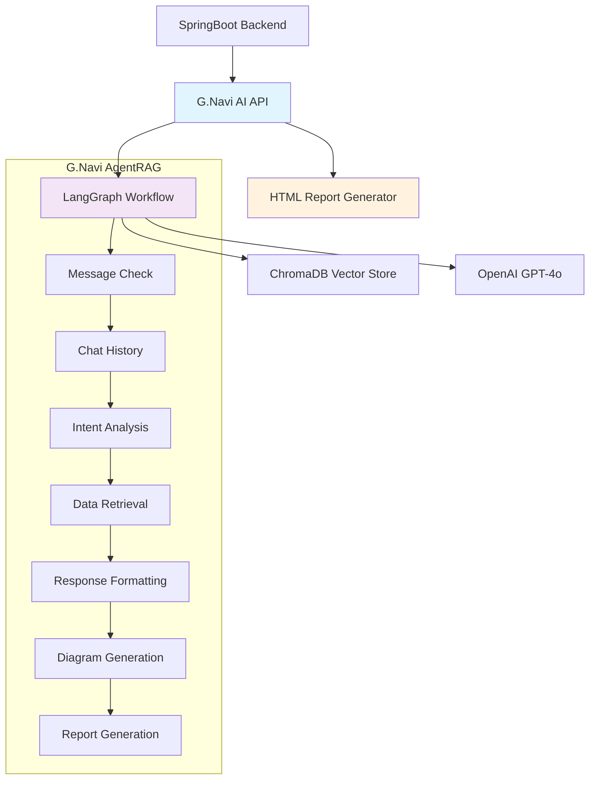

# 🚀 G.Navi AI - 커리어 컨설팅 시스템

> **SK의 AI 기반 커리어 컨설팅 플랫폼**  
> LangGraph 기반 AgentRAG 시스템으로 개인화된 커리어 상담 제공


---

## 📋 목차

- [🎯 프로젝트 개요](#-프로젝트-개요)
- [🏗️ 시스템 아키텍처](#️-시스템-아키텍처)
- [🔄 워크플로우](#-워크플로우)
- [📁 프로젝트 구조](#-프로젝트-구조)
- [🛠️ 기술 스택](#️-기술-스택)
- [⚙️ 설치 및 실행](#️-설치-및-실행)
- [🔧 환경 변수](#-환경-변수)
- [📊 API 문서](#-api-문서)
- [🧪 테스트](#-테스트)
- [🔒 관리자 기능](#-관리자-기능)
- [📈 성능 최적화](#-성능-최적화)
- [🤝 기여 가이드](#-기여-가이드)

---

## 🎯 프로젝트 개요

### ✨ 주요 기능

- **🤖 AI 기반 커리어 상담**: GPT-4o를 활용한 개인화된 커리어 가이드
- **📊 실시간 데이터 검색**: ChromaDB 기반 커리어 사례 및 교육과정 검색
- **🎨 시각적 다이어그램**: Mermaid.js 기반 커리어 로드맵 자동 생성
- **💬 연속 대화 지원**: LangGraph MemorySaver 기반 세션 관리
- **🔒 관리자 리포트**: HTML 보고서 자동 생성 (관리자 전용)

### 🎯 핵심 가치

- **개인화**: 사용자 프로젝트 경험과 스킬에 맞춤형 상담
- **실용성**: 실제 사내 커리어 사례 기반 현실적 조언
- **연속성**: 이전 대화를 기억하는 지능형 상담
- **시각화**: 복잡한 커리어 경로를 직관적 다이어그램으로 표현

---

## 🏗️ 시스템 아키텍처

### 📊 전체 아키텍처



### 🔄 데이터 흐름

1. **사용자 요청** → SpringBoot → G.Navi AI API
2. **세션 관리** → 이전 대화 복원 → LangGraph 워크플로우
3. **AI 분석** → 의도 분석 → 데이터 검색 → 응답 생성
4. **응답 전달** → 마크다운 → 사용자
5. **관리자 기능** → HTML 보고서 생성 (백그라운드)

---

## 🔄 워크플로우

### 📈 6단계 파이프라인

| 단계 | 노드 | 역할 | 출력 |
|------|------|------|------|
| **0️⃣** | Message Check | 메시지 검증 및 상태 초기화 | ✅ 검증된 메시지 |
| **1️⃣** | Chat History | 세션 대화 내역 관리 | 📝 통합된 대화 기록 |
| **2️⃣** | Intent Analysis | 사용자 의도 분석 | 🎯 분석된 의도 |
| **3️⃣** | Data Retrieval | 커리어 사례/교육과정 검색 | 📊 관련 데이터 |
| **4️⃣** | Response Formatting | AI 기반 응답 생성 | 📝 마크다운 응답 |
| **5️⃣** | Diagram Generation | 다이어그램 생성 + 📨 **bot_message 설정** | 🎨 시각적 응답 |
| **6️⃣** | 🔒 Report Generation | 관리자용 HTML 보고서 | 📄 HTML 파일 |

### ⚡ 성능 최적화

- **병렬 처리**: 커리어 사례와 교육과정 동시 검색
- **캐싱**: 세션별 대화 내역 메모리 저장
- **스트리밍**: 단계별 실시간 로그 출력
- **비동기**: FastAPI 기반 비블로킹 처리

---

## 📁 프로젝트 구조

```
g-navi-ai-api/
├── 📄 README.md                     # 프로젝트 문서
├── 📄 requirements.txt              # Python 의존성
├── 📄 Dockerfile                    # 컨테이너 설정
├── 🗂️ app/                          # 메인 애플리케이션
│   ├── 📄 main.py                   # FastAPI 엔트리포인트
│   ├── 📁 api/                      # API 라우터
│   │   └── 📁 v1/                   # API v1 엔드포인트
│   ├── 📁 config/                   # 설정 관리
│   │   └── 📄 settings.py           # 환경 설정
│   ├── 📁 core/                     # 핵심 유틸리티
│   │   └── 📄 dependencies.py       # 의존성 주입
│   ├── 📁 models/                   # 데이터 모델
│   │   ├── 📄 chat.py               # 채팅 모델
│   │   └── 📄 message.py            # 메시지 모델
│   ├── 📁 services/                 # 비즈니스 로직
│   │   ├── 📄 chat_service.py       # 채팅 서비스
│   │   ├── 📄 message_processor.py  # 메시지 처리
│   │   ├── 📄 session_manager.py    # 세션 관리
│   │   ├── 📄 bot_message.py        # 봇 메시지 생성
│   │   ├── 📄 chroma_service.py     # Vector DB 연동
│   │   └── 📄 conversation_history_manager.py
│   ├── 📁 graphs/                   # 🎯 LangGraph 워크플로우
│   │   ├── 📄 state.py              # 상태 정의
│   │   ├── 📄 graph_builder.py      # 그래프 빌더
│   │   ├── 📁 nodes/                # 워크플로우 노드
│   │   │   ├── 📄 message_check.py         # 0️⃣ 메시지 검증
│   │   │   ├── 📄 chat_history.py          # 1️⃣ 대화 내역 관리
│   │   │   ├── 📄 intent_analysis.py       # 2️⃣ 의도 분석
│   │   │   ├── 📄 data_retrieval.py        # 3️⃣ 데이터 검색
│   │   │   ├── 📄 response_formatting.py   # 4️⃣ 응답 포맷팅
│   │   │   ├── 📄 diagram_generation.py    # 5️⃣ 다이어그램 생성
│   │   │   ├── 📄 report_generation.py     # 6️⃣ 🔒 보고서 생성
│   │   │   └── 📄 wait_node.py             # 대기 상태
│   │   └── 📁 agents/               # AI 에이전트
│   │       ├── 📄 analyzer.py       # 의도 분석 에이전트
│   │       ├── 📄 retriever.py      # 데이터 검색 에이전트
│   │       ├── 📄 formatter.py      # 응답 포맷팅 에이전트
│   │       ├── 📄 mermaid_agent.py  # 다이어그램 생성 에이전트
│   │       └── 📄 report_generator.py # 🔒 보고서 생성 에이전트
│   ├── 📁 storage/                  # 데이터 저장소
│   │   ├── 📁 docs/                 # 문서 파일
│   │   ├── 📁 vector_stores/        # Vector DB 데이터
│   │   └── 📁 cache/                # 캐시 데이터
│   └── 📁 utils/                    # 유틸리티
├── 📁 output/                       # 🔒 생성된 보고서
├── 📁 k8s/                          # Kubernetes 설정
└── 📁 venv310/                      # Python 가상환경
```

---

## 🛠️ 기술 스택

### 🐍 Core Framework
- **FastAPI 0.104+**: 고성능 비동기 웹 프레임워크
- **Python 3.10+**: 최신 Python 기능 활용
- **Pydantic**: 데이터 검증 및 직렬화

### 🤖 AI & ML
- **LangGraph**: 복잡한 AI 워크플로우 관리
- **OpenAI GPT-4o**: 고급 언어 모델
- **ChromaDB**: 벡터 검색 데이터베이스
- **LangChain**: AI 애플리케이션 구축 프레임워크

### 📊 Data & Storage
- **ChromaDB**: 벡터 임베딩 저장소
- **MemorySaver**: 세션 상태 메모리 관리
- **JSON**: 구조화된 데이터 저장

### 🎨 Visualization
- **Mermaid.js**: 다이어그램 자동 생성
- **Markdown**: 텍스트 포맷팅
- **HTML/CSS**: 보고서 템플릿

### 🚀 DevOps
- **Docker**: 컨테이너화
- **Kubernetes**: 오케스트레이션
- **Poetry/pip**: 의존성 관리

---

## ⚙️ 설치 및 실행

### 📋 사전 요구사항

- Python 3.10+
- OpenAI API Key
- ChromaDB 접근 권한 (선택)

### 🔧 로컬 개발 환경

```bash
# 1. 저장소 클론
git clone <repository-url>
cd g-navi-ai-api

# 2. 가상환경 생성
python3.10 -m venv venv310
source venv310/bin/activate  # macOS/Linux
# venv310\Scripts\activate  # Windows

# 3. 의존성 설치
pip install -r requirements.txt

# 4. 환경 변수 설정
cp .env.example .env
# .env 파일 편집 (아래 환경 변수 섹션 참고)

# 5. 애플리케이션 실행
uvicorn app.main:app --host 0.0.0.0 --port 8000 --reload
```

### 🐳 Docker 실행

```bash
# 1. Docker 이미지 빌드
docker build -t g-navi-ai-api .

# 2. 컨테이너 실행
docker run -p 8000:8000 \
  -e OPENAI_API_KEY=your_openai_key \
  -e CHROMA_AUTH_CREDENTIALS=your_chroma_credentials \
  g-navi-ai-api
```

### ☸️ Kubernetes 배포

```bash
# 1. 네임스페이스 생성
kubectl create namespace g-navi

# 2. Secret 생성
kubectl create secret generic g-navi-secrets \
  --from-literal=openai-api-key=your_key \
  --from-literal=chroma-credentials=your_credentials \
  -n g-navi

# 3. 애플리케이션 배포
kubectl apply -f k8s/ -n g-navi
```

---

## 🔧 환경 변수

### 📝 필수 환경 변수

```bash
# OpenAI 설정
OPENAI_API_KEY=sk-...                 # OpenAI API 키
OPENAI_MODEL=gpt-4o                   # 사용할 모델
OPENAI_MAX_TOKENS=2000                # 최대 토큰 수
OPENAI_TEMPERATURE=0.3                # 창의성 조절

# ChromaDB 설정 (선택)
CHROMA_USE_EXTERNAL=true              # 외부 ChromaDB 사용 여부
CHROMA_EXTERNAL_URL=https://...       # 외부 ChromaDB URL
CHROMA_HOST=chroma-service            # K8s 내부 호스트
CHROMA_PORT=8000                      # ChromaDB 포트
CHROMA_AUTH_CREDENTIALS=user:pass     # 인증 정보 (Base64 전 원본)

# 애플리케이션 설정
DEBUG=false                           # 디버그 모드
LOG_LEVEL=INFO                        # 로그 레벨
MAX_WORKERS=4                         # 워커 프로세스 수
```

### 🔒 보안 설정

```bash
# 민감한 정보는 환경 변수나 시크릿으로 관리
export OPENAI_API_KEY="your-secret-key"
export CHROMA_AUTH_CREDENTIALS="your-credentials"

# Kubernetes 시크릿 사용 권장
kubectl create secret generic api-secrets \
  --from-literal=openai-key="$OPENAI_API_KEY" \
  --from-literal=chroma-auth="$CHROMA_AUTH_CREDENTIALS"
```

---

## 📊 API 문서

### 🌐 API 엔드포인트

애플리케이션 실행 후 다음 URL에서 API 문서 확인:

- **Swagger UI**: http://localhost:8000/docs
- **ReDoc**: http://localhost:8000/redoc
- **OpenAPI Spec**: http://localhost:8000/openapi.json

### 🚀 주요 엔드포인트

```http
# 헬스 체크
GET /health

# 새 채팅 세션 생성
POST /api/v1/chat/sessions
Content-Type: application/json
{
  "conversation_id": "room1",
  "user_info": {
    "name": "김개발",
    "projects": [...]
  }
}

# 기존 세션 로드
POST /api/v1/chat/sessions/load
Content-Type: application/json
{
  "conversation_id": "room1",
  "user_info": {...},
  "previous_messages": [...]
}

# 메시지 전송
POST /api/v1/chat/message
Content-Type: application/json
{
  "conversation_id": "room1",
  "user_question": "백엔드 개발자에서 PM으로 전환하려면 어떤 준비가 필요한가요?",
  "user_info": {...}
}

# 세션 종료
DELETE /api/v1/chat/sessions/{conversation_id}
```

### 📝 응답 예시

```json
{
  "success": true,
  "message": "안녕하세요! 저는 G.Navi AI 커리어 코치예요...",
  "conversation_id": "room1",
  "processing_time_ms": 3450,
  "diagram_generated": true,
  "report_generated": true
}
```

---

## 🧪 테스트

### 🔍 단위 테스트

```bash
# 전체 테스트 실행
python -m pytest

# 특정 모듈 테스트
python -m pytest tests/test_chat_service.py

# 커버리지 포함
python -m pytest --cov=app tests/
```

### 🚀 통합 테스트

```bash
# API 엔드포인트 테스트
python -m pytest tests/test_api.py

# 워크플로우 테스트
python -m pytest tests/test_workflow.py
```

### 📊 성능 테스트

```bash
# 부하 테스트 (locust 사용)
locust -f tests/performance/locustfile.py --host=http://localhost:8000
```

### 🧪 수동 테스트

```bash
# 간단한 메시지 테스트
python test_previous_messages.py
```

---

## 🔒 관리자 기능

### 📄 HTML 보고서 생성

6단계에서 실행되는 **관리자 전용 기능**:

- **자동 생성**: 모든 상담에 대해 HTML 보고서 자동 생성
- **저장 위치**: `./output/` 폴더
- **파일명 형식**: `{사용자명}_{YYYYMMDD_HHMMSS}.html`
- **기능**: 
  - 마크다운을 HTML로 변환
  - Mermaid 다이어그램 렌더링
  - 아름다운 CSS 스타일링
  - 타임스탬프 자동 추가

### 🔧 관리자 설정

```python
# app/graphs/agents/report_generator.py
def should_generate_report(self, user_question: str, user_data: Dict[str, Any]) -> bool:
    return True  # 🔒 관리자 설정: 모든 상담에 대해 보고서 생성
    
    # 키워드 기반 생성으로 변경하려면:
    # report_keywords = ["보고서", "리포트", "문서", "저장"]
    # return any(keyword in user_question.lower() for keyword in report_keywords)
```

### 📊 생성된 보고서 예시

```html
<!DOCTYPE html>
<html lang="ko">
<head>
    <title>G.Navi AI 커리어 컨설팅 보고서</title>
    <!-- Mermaid.js 및 스타일시트 -->
</head>
<body>
    <div class="container">
        <!-- AI 응답 내용 (HTML 변환) -->
        <!-- Mermaid 다이어그램 -->
        <div class="timestamp">
            보고서 생성일시: 2025년 6월 23일 15시 30분
        </div>
    </div>
</body>
</html>
```

---

## 📈 성능 최적화

### ⚡ 응답 속도 개선

- **5단계 완료 시 사용자 응답 준비**: bot_message를 5단계에서 설정하여 빠른 응답
- **6단계는 백그라운드 처리**: 관리자 기능이므로 사용자 대기시간에 영향 없음
- **병렬 데이터 검색**: 커리어 사례와 교육과정 동시 검색
- **캐싱 전략**: 세션별 상태 메모리 관리

### 📊 리소스 최적화

- **토큰 사용량 관리**: 대화 내역 자동 압축
- **메모리 효율성**: 불필요한 데이터 정리
- **비동기 처리**: I/O 바운드 작업 최적화

### 🔍 모니터링

```python
# 단계별 처리 시간 추적
processing_log = [
    "0단계 처리 시간: 15ms",
    "1단계 처리 시간: 45ms", 
    "2단계 처리 시간: 1.2초",
    "3단계 처리 시간: 1.3초",
    "4단계 처리 시간: 3.1초",
    "5단계 처리 시간: 3.7초",  # 📨 사용자 응답 완료
    "6단계 처리 시간: 42ms"    # 🔒 관리자 백그라운드
]
```

---

## 🎯 주요 개선사항 (최신)

### 🔄 **Previous Messages 통합 완료**

- ✅ `previous_messages` 상태 제거
- ✅ 모든 채팅 기록을 `current_session_messages`로 통합
- ✅ SpringBoot 메시지 자동 복원 및 통합
- ✅ 메타데이터 기반 메시지 분류

### 📨 **응답 처리 최적화**

- ✅ `bot_message` 설정을 5단계로 이동 (빠른 응답)
- ✅ 6단계는 관리자 전용으로 격리
- ✅ MessageProcessor 응답 추출 로직 개선
- ✅ 다단계 폴백 메커니즘 구현

### 🔒 **관리자 기능 분리**

- ✅ Report Generator를 관리자 전용으로 명확화
- ✅ 사용자 경험과 관리자 기능 완전 분리
- ✅ 🔒 아이콘으로 관리자 전용 표시
- ✅ 보고서 생성 실패가 사용자에게 영향 없음

### 🎨 **Mermaid 다이어그램 수정**

- ✅ `MermaidDiagramAgent` 클래스 올바른 구현
- ✅ `mermaid_agent.py` 파일 내용 정정
- ✅ 다이어그램 생성 오류 해결
- ✅ HTML 보고서에 Mermaid 렌더링 지원

---

## 🤝 기여 가이드

### 🛠️ 개발 워크플로우

1. **이슈 생성**: 기능 요청이나 버그 리포트
2. **브랜치 생성**: `feature/feature-name` 또는 `fix/bug-name`
3. **개발**: 코드 작성 및 테스트
4. **PR 생성**: 상세한 설명과 함께 Pull Request
5. **코드 리뷰**: 팀원 검토 및 피드백
6. **머지**: 승인 후 main 브랜치에 병합

### 📝 커밋 컨벤션

```bash
feat: 새로운 기능 추가
fix: 버그 수정
docs: 문서 수정
style: 코드 포맷팅
refactor: 코드 리팩토링
test: 테스트 추가
chore: 기타 작업
```

### 🧪 기여 전 체크리스트

- [ ] 코드 스타일 가이드 준수
- [ ] 단위 테스트 작성 및 통과
- [ ] 문서 업데이트
- [ ] 성능 영향도 검토
- [ ] 보안 취약점 검토

---

## 📞 문의 및 지원

### 🤝 팀 연락처

- **개발팀**: dev-team@sk.com
- **기술 지원**: tech-support@sk.com
- **사용자 지원**: user-support@sk.com

### 📚 추가 자료

- [API 문서](http://localhost:8000/docs)
- [LangGraph 공식 문서](https://langchain-ai.github.io/langgraph/)
- [FastAPI 공식 문서](https://fastapi.tiangolo.com/)
- [ChromaDB 공식 문서](https://docs.trychroma.com/)

### 🐛 버그 신고

문제 발생 시 다음 정보와 함께 이슈를 생성해주세요:

- 운영체제 및 Python 버전
- 에러 메시지 및 로그
- 재현 가능한 단계
- 기대하는 동작

---

## 📜 라이선스

이 프로젝트는 SK 내부 라이선스 하에 있습니다.

---

## 🔄 최근 업데이트

### v2.1.0 (2025-06-23)
- 🔄 Previous messages 통합 완료
- 📨 Bot message 처리 최적화
- 🔒 관리자 기능 분리
- 🎨 Mermaid 다이어그램 수정
- 📚 문서 업데이트

### v2.0.0 (2025-06-20)
- 🚀 LangGraph 기반 워크플로우 도입
- 🤖 6단계 파이프라인 구현
- 📊 ChromaDB 연동
- 🎨 Mermaid 다이어그램 지원

### v1.0.0 (2025-06-15)
- 🎯 초기 프로젝트 구조
- 🤖 OpenAI 통합
- 📝 기본 채팅 기능

---

**💡 G.Navi AI로 더 나은 커리어를 설계하세요!**
