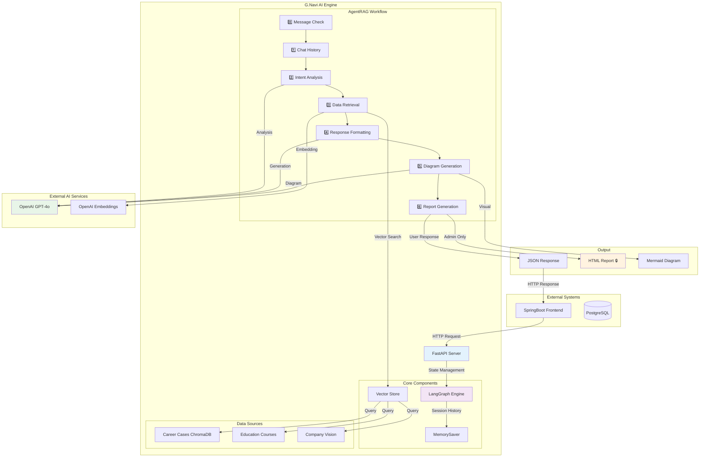
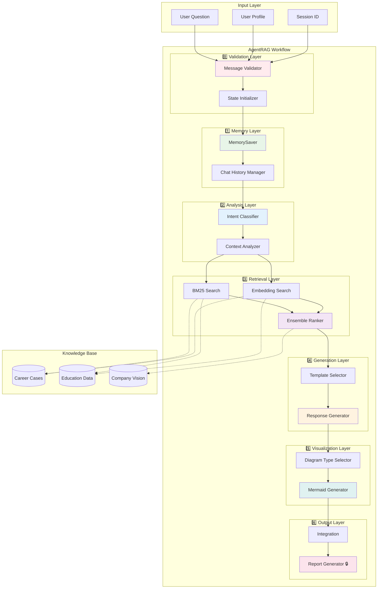
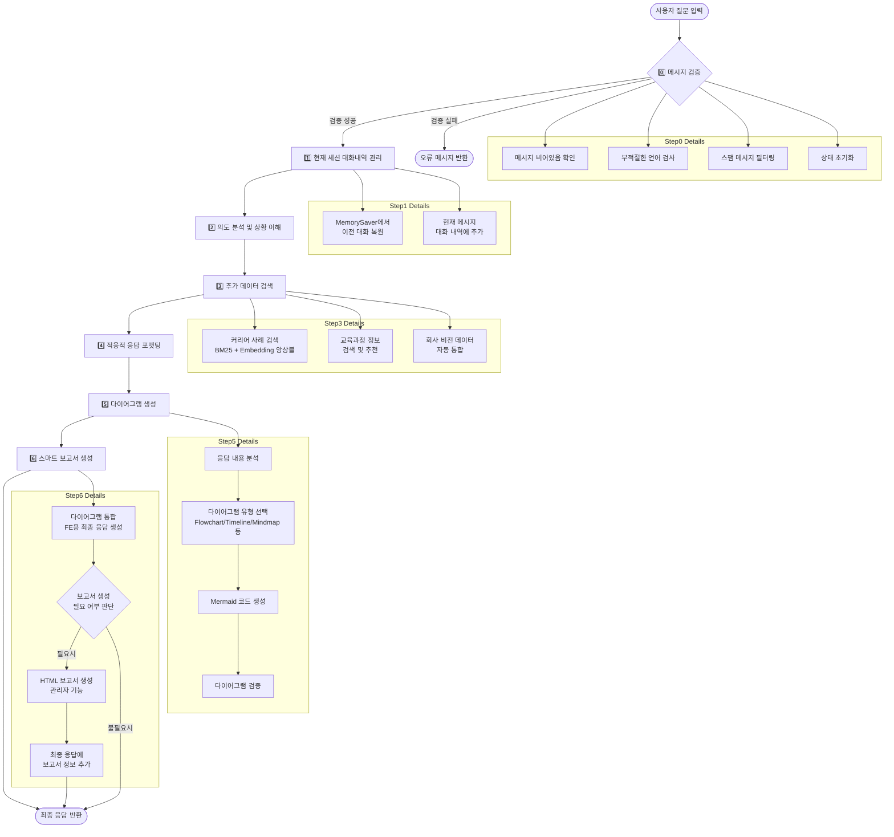
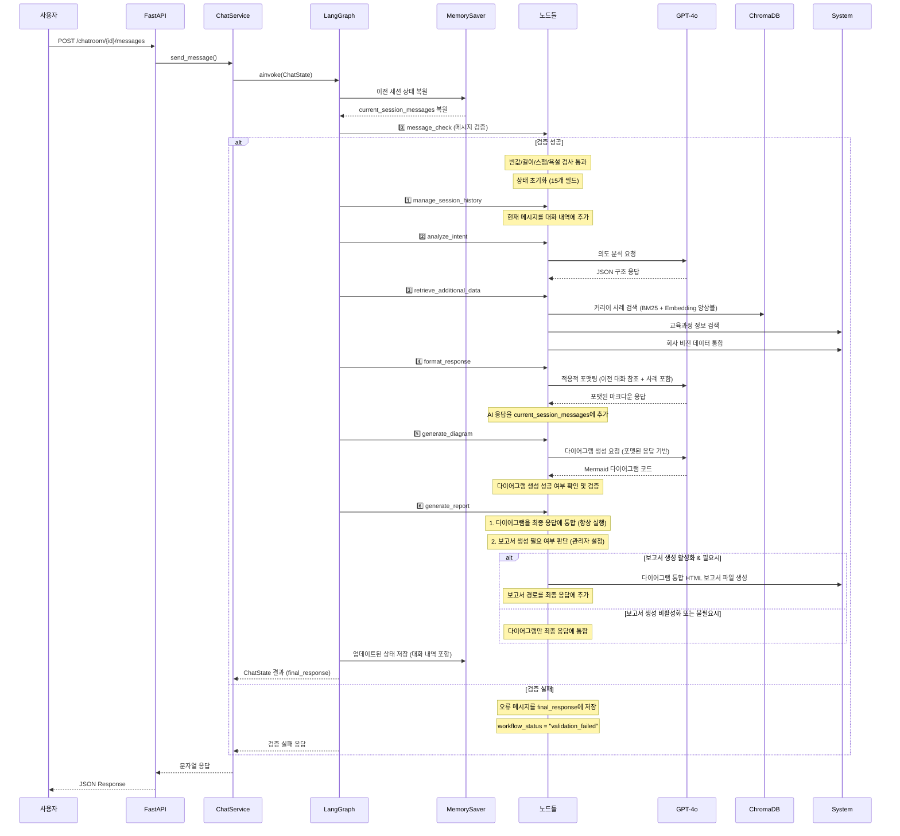

# 🚀 G.Navi AI - 커리어 컨설팅 시스템

> **SK의 AI 기반 커리어 컨설팅 플랫폼**  
> LangGraph 기반 AgentRAG 시스템으로 개인화된 커리어 상담 제공


---

## 📋 목차

- [🎯 프로젝트 개요](#-프로젝트-개요)
- [🏗️ 시스템 아키텍처](#️-시스템-아키텍처)
- [🔄 워크플로우](#-워크플로우)
- [📁 프로젝트 구조](#-프로젝트-구조)
- [🛠️ 기술 스택](#️-기술-스택)
- [⚙️ 설치 및 실행](#️-설치-및-실행)
- [🔧 환경 변수](#-환경-변수)
- [📊 API 문서](#-api-문서)
- [🧪 테스트](#-테스트)
- [🔒 관리자 기능](#-관리자-기능)
- [📈 성능 최적화](#-성능-최적화)
- [🤝 기여 가이드](#-기여-가이드)

---

## 🎯 프로젝트 개요

### ✨ 주요 기능

- **🤖 AI 기반 커리어 상담**: GPT-4o를 활용한 개인화된 커리어 가이드
- **📊 실시간 데이터 검색**: ChromaDB 기반 커리어 사례 및 교육과정 검색
- **🎨 시각적 다이어그램**: Mermaid.js 기반 커리어 로드맵 자동 생성
- **💬 연속 대화 지원**: LangGraph MemorySaver 기반 세션 관리
- **🔒 관리자 리포트**: HTML 보고서 자동 생성 (관리자 전용)

### 🎯 핵심 가치

- **개인화**: 사용자 프로젝트 경험과 스킬에 맞춤형 상담
- **실용성**: 실제 사내 커리어 사례 기반 현실적 조언
- **연속성**: 이전 대화를 기억하는 지능형 상담
- **시각화**: 복잡한 커리어 경로를 직관적 다이어그램으로 표현

### 🔬 기술적 차별성

#### 🧠 AgentRAG 아키텍처
- **Agent-based RAG**: 각 노드별 전문화된 추론 과정
- **구조화된 워크플로우**: 7단계 파이프라인으로 명확한 역할 분담
- **상태 기반 처리**: TypedDict를 활용한 강타입 상태 관리

#### 📊 하이브리드 검색 시스템
- **BM25 + Embedding 앙상블**: 키워드와 의미 기반 검색 결합
- **ChromaDB 기반 벡터 저장소**: 빠른 유사도 검색
- **다중 데이터 소스**: 커리어 사례, 교육과정, 회사 비전 통합

#### 🎨 적응적 응답 생성
- **질문 유형별 포맷팅**: 커리어 상담 특화 응답 템플릿
- **시각적 표현**: Mermaid.js 기반 다이어그램 자동 생성
- **맥락 인식**: 이전 대화 기반 연속적 상담

#### 🔄 상태 지속성
- **LangGraph MemorySaver**: 세션별 대화 내역 자동 관리
- **중단점 지원**: 워크플로우 중간 상태 저장 및 복원
- **에러 복구**: 실패 시점에서 재시작 가능

---

## 🏗️ 시스템 아키텍처

### 📊 전체 아키텍처



### 🏗️ AgentRAG 상세 아키텍처



### 🔄 데이터 흐름

1. **사용자 요청** → SpringBoot → G.Navi AI API
2. **세션 관리** → 이전 대화 복원 → LangGraph 워크플로우
3. **AI 분석** → 의도 분석 → 데이터 검색 → 응답 생성
4. **응답 전달** → 마크다운 → 사용자
5. **관리자 기능** → HTML 보고서 생성 (백그라운드)

---

## 🔄 AgentRAG 워크플로우

### 🧠 AgentRAG 시스템 개요

G.Navi는 **AgentRAG(Agent-based Retrieval Augmented Generation)** 아키텍처를 기반으로 한 AI 커리어 컨설팅 시스템입니다. 사내 구성원들의 실제 커리어 사례와 최신 업계 트렌드를 분석하여 개인화된 커리어 조언을 제공합니다.

#### 🎯 핵심 특징
- **7단계 AgentRAG 워크플로우**로 구조화된 추론 과정 (메시지 검증 포함)
- **LangGraph + MemorySaver 기반** 상태 관리 및 대화 지속성
- **실제 커리어 사례** 기반 추천 시스템 (BM25 + Embedding 앙상블)
- **적응적 응답 포맷팅**으로 사용자 맞춤형 출력
- **Mermaid.js 다이어그램 생성** 및 시각적 표현
- **스마트 HTML 보고서 생성** 기능 (관리자 제어)
- **대화 연속성 지원**으로 맥락을 유지하는 멀티턴 대화

### � 7단계 처리 과정 (메시지 검증 포함)



### 📊 각 단계별 상세 설명

| 단계 | 담당 Node | 주요 기능 | 출력 |
|------|-----------|-----------|------|
| **0단계** | MessageCheckNode | 메시지 검증 및 상태 초기화 | 조건부 분기 (검증 성공/실패) |
| **1단계** | ChatHistoryNode | MemorySaver 기반 현재 세션 대화 관리 | `current_session_messages` |
| **2단계** | IntentAnalysisNode | 질문 의도 분석 및 상황 파악 | `intent_analysis` |
| **3단계** | DataRetrievalNode | 커리어 사례 + 교육과정 + 회사 비전 검색 | `career_cases`, `education_courses` |
| **4단계** | ResponseFormattingNode | 질문 유형별 적응적 응답 생성 | `formatted_response` |
| **5단계** | DiagramGenerationNode | Mermaid 다이어그램 생성 및 검증 + 📨 **bot_message 설정** | `mermaid_diagram`, `diagram_generated` |
| **6단계** | ReportGenerationNode | 다이어그램 통합 + HTML 보고서 생성 (🔒 관리자 기능) | `final_response`, `report_path` |

### 🔄 데이터 변환 과정



### � ChatState 구조

```python
class ChatState(TypedDict, total=False):  # 선택적 필드 허용
    # === 입력 데이터 (필수) ===
    user_question: str                   # 사용자 질문
    user_data: Dict[str, Any]           # 사용자 프로필 데이터
    session_id: str                     # 세션 식별자
    
    # === 메시지 검증 및 상태 관리 ===
    workflow_status: str                # 워크플로우 상태 (normal, validation_failed)
    
    # === 대화 내역 관리 (MemorySaver가 자동 관리) ===
    current_session_messages: List[Dict[str, str]]  # role, content, timestamp
    
    # === G.Navi 7단계 처리 결과 ===
    intent_analysis: Dict[str, Any]       # 2단계: 의도 분석
    career_cases: List[Any]              # 3단계: 커리어 사례 (회사 비전 포함)
    education_courses: Dict[str, Any]    # 3단계: 교육과정 추천
    formatted_response: Dict[str, Any]    # 4단계: 포맷된 응답
    mermaid_diagram: str                 # 5단계: 생성된 Mermaid 다이어그램 코드
    diagram_generated: bool              # 5단계: 다이어그램 생성 성공 여부
    final_response: Dict[str, Any]        # 6단계: 최종 응답 (다이어그램 통합)
    
    # === 메타데이터 및 로깅 ===
    processing_log: List[str]            # 처리 로그 추적
    error_messages: List[str]            # 오류 메시지 수집
    total_processing_time: float         # 총 처리 시간
```

### ⚡ 성능 최적화

- **병렬 처리**: 커리어 사례와 교육과정 동시 검색
- **캐싱**: 세션별 대화 내역 메모리 저장
- **스트리밍**: 단계별 실시간 로그 출력
- **비동기**: FastAPI 기반 비블로킹 처리
- **MemorySaver**: LangGraph 기반 상태 지속성
- **BM25 + Embedding 앙상블**: 하이브리드 검색으로 정확도 향상

### 🔬 핵심 알고리즘

#### 📊 하이브리드 검색 (BM25 + Embedding 앙상블)

```python
def hybrid_search(query: str, k: int = 10) -> List[Document]:
    """
    BM25와 Embedding 검색을 결합한 하이브리드 검색
    
    가중치:
    - BM25 (키워드 기반): 70%
    - Embedding (의미 기반): 30%
    """
    # 1. BM25 검색 (키워드 매칭)
    bm25_results = bm25_retriever.search(query, k=k*2)
    
    # 2. Embedding 검색 (의미 유사도)
    embedding_results = vector_store.similarity_search(query, k=k*2)
    
    # 3. 점수 정규화 및 앙상블
    final_scores = {}
    for doc in bm25_results:
        final_scores[doc.id] = 0.7 * doc.score
    
    for doc in embedding_results:
        if doc.id in final_scores:
            final_scores[doc.id] += 0.3 * doc.score
        else:
            final_scores[doc.id] = 0.3 * doc.score
    
    # 4. 최종 순위 결정
    return sorted(final_scores.items(), key=lambda x: x[1], reverse=True)[:k]
```

#### 🎯 적응적 응답 포맷팅

```python
def adaptive_formatting(intent_type: str, context: Dict) -> str:
    """
    질문 유형별 맞춤형 응답 템플릿 선택
    """
    templates = {
        "career_transition": "transition_template.md",
        "skill_development": "skill_template.md",
        "project_advice": "project_template.md",
        "general_consultation": "general_template.md"
    }
    
    template = templates.get(intent_type, "general_template.md")
    return generate_response_with_template(template, context)
```

#### 🎨 다이어그램 타입 자동 선택

```python
def select_diagram_type(response_content: str) -> str:
    """
    응답 내용을 분석하여 최적의 다이어그램 타입 선택
    """
    if "단계" in response_content or "프로세스" in response_content:
        return "flowchart"
    elif "시간" in response_content or "로드맵" in response_content:
        return "timeline"
    elif "관계" in response_content or "구조" in response_content:
        return "mindmap"
    else:
        return "flowchart"  # 기본값
```

### 🔒 보안 및 품질 관리

#### 📝 메시지 검증 시스템

```python
class MessageValidator:
    """다층 메시지 검증 시스템"""
    
    def validate(self, message: str) -> ValidationResult:
        # 1. 기본 검증
        if not message or len(message.strip()) == 0:
            return ValidationResult(False, "empty_message")
        
        # 2. 길이 검증
        if len(message) > MAX_MESSAGE_LENGTH:
            return ValidationResult(False, "message_too_long")
        
        # 3. 스팸 필터링
        if self.is_spam(message):
            return ValidationResult(False, "spam_detected")
        
        # 4. 부적절한 콘텐츠 검사
        if self.contains_inappropriate_content(message):
            return ValidationResult(False, "inappropriate_content")
        
        return ValidationResult(True, "valid")
```

#### 🛡️ 에러 복구 메커니즘

```python
async def workflow_with_recovery(state: ChatState) -> ChatState:
    """실패 지점에서 자동 복구하는 워크플로우"""
    
    try:
        # 체크포인트 저장
        await save_checkpoint(state)
        
        # 각 노드 실행
        result = await execute_workflow(state)
        
        return result
        
    except WorkflowException as e:
        # 마지막 성공 지점에서 복구
        recovered_state = await load_last_checkpoint(state.session_id)
        
        # 대체 응답 생성
        fallback_response = generate_fallback_response(e.error_type)
        recovered_state["final_response"] = fallback_response
        
        return recovered_state
```

---

## 📊 데이터 모델

### 🗂️ ChatState 상세 구조

```python
from typing import TypedDict, List, Dict, Any, Optional

class ChatState(TypedDict, total=False):
    """G.Navi AgentRAG 워크플로우 상태 모델"""
    
    # === 📥 입력 데이터 (필수) ===
    user_question: str                   # 사용자 질문 텍스트
    user_data: Dict[str, Any]           # 사용자 프로필 정보
    session_id: str                     # 세션 고유 식별자
    
    # === 🔍 메시지 검증 및 상태 관리 ===
    workflow_status: str                # "normal" | "validation_failed"
    
    # === 💬 대화 내역 관리 (MemorySaver 자동 관리) ===
    current_session_messages: List[Dict[str, str]]  # 세션 대화 기록
    # 메시지 형식: {"role": "user|assistant", "content": "...", "timestamp": "..."}
    
    # === 🎯 AgentRAG 7단계 처리 결과 ===
    intent_analysis: Dict[str, Any]       # 2️⃣ 의도 분석 결과
    career_cases: List[Any]              # 3️⃣ 검색된 커리어 사례
    education_courses: Dict[str, Any]    # 3️⃣ 추천 교육과정
    formatted_response: Dict[str, Any]    # 4️⃣ 포맷된 응답
    mermaid_diagram: str                 # 5️⃣ 생성된 Mermaid 다이어그램
    diagram_generated: bool              # 5️⃣ 다이어그램 생성 성공 여부
    final_response: Dict[str, Any]        # 6️⃣ 최종 통합 응답
    
    # === 📋 메타데이터 및 디버깅 ===
    processing_log: List[str]            # 단계별 처리 로그
    error_messages: List[str]            # 오류 메시지 수집
    total_processing_time: float         # 총 처리 시간 (초)
```

### 📝 UserData 모델

```python
class UserData(BaseModel):
    """사용자 프로필 데이터 모델"""
    
    # === 기본 정보 ===
    username: str                        # 사용자명
    current_position: Optional[str]      # 현재 직급/직책
    department: Optional[str]            # 소속 부서
    
    # === 경력 정보 ===
    experience_years: Optional[int]      # 총 경력 년수
    current_projects: List[str]          # 현재 참여 프로젝트
    completed_projects: List[str]        # 완료된 프로젝트
    
    # === 스킬 및 관심사 ===
    technical_skills: List[str]          # 기술 스킬
    soft_skills: List[str]               # 소프트 스킬
    career_interests: List[str]          # 관심 분야
    career_goals: Optional[str]          # 커리어 목표
    
    # === 학습 이력 ===
    completed_courses: List[str]         # 수강 완료 과정
    certifications: List[str]            # 보유 자격증
```

### 🎯 IntentAnalysis 결과 모델

```python
class IntentAnalysis(BaseModel):
    """의도 분석 결과 모델"""
    
    intent_type: str                     # 의도 분류
    confidence: float                    # 분류 신뢰도 (0.0-1.0)
    key_topics: List[str]               # 핵심 주제
    user_context: Dict[str, Any]        # 사용자 상황 분석
    recommended_actions: List[str]       # 추천 액션
    
    # 의도 분류 타입
    # - "career_transition": 직무/부서 전환 상담
    # - "skill_development": 역량 개발 상담  
    # - "project_advice": 프로젝트 관련 조언
    # - "education_planning": 교육 계획 수립
    # - "general_consultation": 일반 상담
```

### 📊 CareerCase 모델

```python
class CareerCase(BaseModel):
    """커리어 사례 데이터 모델"""
    
    case_id: str                         # 사례 고유 ID
    title: str                           # 사례 제목
    description: str                     # 상세 설명
    
    # === 인물 정보 ===
    person_info: Dict[str, Any]          # 익명화된 인물 정보
    career_path: List[str]               # 커리어 경로
    key_decisions: List[str]             # 주요 결정사항
    
    # === 성과 및 교훈 ===
    achievements: List[str]              # 성취사항
    lessons_learned: List[str]           # 교훈
    applicable_skills: List[str]         # 적용 가능 스킬
    
    # === 메타데이터 ===
    relevance_score: float               # 검색 관련도 점수
    tags: List[str]                      # 태그
    created_at: str                      # 생성일
```

### 📈 EducationCourse 모델

```python
class EducationCourse(BaseModel):
    """교육과정 데이터 모델"""
    
    course_id: str                       # 과정 고유 ID
    title: str                           # 과정명
    provider: str                        # 제공기관
    
    # === 과정 정보 ===
    description: str                     # 과정 설명
    learning_objectives: List[str]       # 학습 목표
    curriculum: List[str]                # 커리큘럼
    
    # === 수강 정보 ===
    duration: str                        # 과정 기간
    difficulty_level: str                # 난이도
    prerequisites: List[str]             # 선수조건
    target_audience: List[str]           # 대상자
    
    # === 메타데이터 ===
    rating: Optional[float]              # 평점
    enrollment_count: Optional[int]      # 수강생 수
    recommendation_score: float          # 추천 점수
```

---

## 🔌 API 문서

### 📡 주요 엔드포인트

#### 💬 채팅 메시지 전송

```http
POST /api/v1/chatroom/{chatroom_id}/messages
Content-Type: application/json

{
    "message": "데이터 분석 분야로 전환하고 싶은데 어떤 준비를 해야 할까요?",
    "user_data": {
        "username": "김개발",
        "current_position": "백엔드 개발자",
        "experience_years": 3,
        "technical_skills": ["Python", "Java", "SQL"],
        "career_goals": "데이터 분석 전문가"
    }
}
```

**응답 예시:**

```json
{
    "success": true,
    "data": {
        "message": "# 데이터 분석 분야 전환 가이드\n\n백엔드 개발 경험을 바탕으로 데이터 분석 분야로의 전환을 위한 맞춤형 로드맵을 제안드립니다...",
        "diagram": "graph TD\n    A[현재: 백엔드 개발자] --> B[데이터 처리 역량 강화]\n    B --> C[통계/수학 기초 학습]...",
        "metadata": {
            "session_id": "session_12345",
            "processing_time": 2.34,
            "diagram_generated": true,
            "report_available": false
        }
    }
}
```

#### 📊 세션 상태 조회

```http
GET /api/v1/chatroom/{chatroom_id}/status
```

**응답:**

```json
{
    "session_id": "session_12345",
    "message_count": 5,
    "last_activity": "2024-01-15T10:30:00Z",
    "total_processing_time": 12.45,
    "workflow_status": "normal"
}
```

#### 🔒 관리자 보고서 조회

```http
GET /api/v1/admin/reports/{session_id}
Authorization: Bearer <admin_token>
```

**응답:**

```json
{
    "report_path": "/output/session_12345_20240115_103000.html",
    "generated_at": "2024-01-15T10:30:00Z",
    "session_summary": {
        "total_messages": 5,
        "topics_discussed": ["career_transition", "skill_development"],
        "diagrams_generated": 2
    }
}
```

### 🔧 헬스체크

```http
GET /health
```

**응답:**

```json
{
    "status": "healthy",
    "timestamp": "2024-01-15T10:30:00Z",
    "services": {
        "openai": "connected",
        "chroma": "connected",
        "memory": "available"
    }
}
```

---

## 📁 프로젝트 구조

```
g-navi-ai-api/
├── 📄 README.md                     # 📖 프로젝트 문서
├── 📄 requirements.txt              # 📦 Python 의존성
├── 📄 Dockerfile                    # 🐳 컨테이너 설정
├── � .env.example                  # 🔧 환경변수 템플릿
├── �🗂️ app/                          # 🏠 메인 애플리케이션
│   ├── 📄 main.py                   # 🚀 FastAPI 엔트리포인트
│   ├── � __init__.py              # 패키지 초기화
│   │
│   ├── �📁 api/                      # 🌐 API 라우터
│   │   ├── 📄 __init__.py
│   │   ├── 📄 deps.py              # 의존성 주입
│   │   └── 📁 v1/                   # API v1 엔드포인트
│   │       ├── 📄 __init__.py
│   │       ├── 📄 chat.py          # 채팅 API
│   │       ├── 📄 health.py        # 헬스체크 API
│   │       └── 📄 admin.py         # 🔒 관리자 API
│   │
│   ├── 📁 core/                     # 🏗️ 핵심 시스템
│   │   ├── 📄 __init__.py
│   │   ├── 📄 dependencies.py      # 의존성 관리
│   │   ├── 📄 security.py          # 보안 모듈
│   │   └── 📄 exceptions.py        # 예외 처리
│   │
│   ├── 📁 config/                   # ⚙️ 설정 관리
│   │   ├── 📄 __init__.py
│   │   ├── 📄 settings.py          # 환경 설정
│   │   └── 📄 logging.py           # 로깅 설정
│   │
│   ├── 📁 models/                   # 📊 데이터 모델
│   │   ├── 📄 __init__.py
│   │   ├── 📄 chat.py              # 채팅 모델
│   │   ├── 📄 message.py           # 메시지 모델
│   │   ├── 📄 user.py              # 사용자 모델
│   │   └── 📄 response.py          # 응답 모델
│   │
│   ├── 📁 services/                 # 🔧 비즈니스 로직
│   │   ├── 📄 __init__.py
│   │   ├── 📄 chat_service.py      # 채팅 서비스
│   │   ├── 📄 chat_session_service.py # 세션 관리
│   │   ├── 📄 message_processor.py # 메시지 처리
│   │   ├── 📄 session_manager.py   # 세션 매니저
│   │   ├── 📄 bot_message.py       # 봇 메시지 생성
│   │   ├── 📄 chroma_service.py    # Vector DB 연동
│   │   └── 📄 conversation_history_manager.py # 대화 이력 관리
│   │
│   ├── 📁 graphs/ 🎯                # LangGraph 워크플로우
│   │   ├── 📄 __init__.py
│   │   ├── 📄 state.py             # ChatState 정의
│   │   ├── 📄 graph_builder.py     # 그래프 빌더
│   │   │
│   │   ├── 📁 nodes/               # 🔗 워크플로우 노드
│   │   │   ├── 📄 __init__.py
│   │   │   ├── 📄 message_check.py         # 0️⃣ 메시지 검증
│   │   │   ├── 📄 chat_history.py          # 1️⃣ 대화 내역 관리
│   │   │   ├── 📄 intent_analysis.py       # 2️⃣ 의도 분석
│   │   │   ├── 📄 data_retrieval.py        # 3️⃣ 데이터 검색
│   │   │   ├── 📄 response_formatting.py   # 4️⃣ 응답 포맷팅
│   │   │   ├── 📄 diagram_generation.py    # 5️⃣ 다이어그램 생성
│   │   │   └── 📄 report_generation.py     # 6️⃣ 🔒 보고서 생성
│   │   │
│   │   └── 📁 agents/ 🤖            # AI 에이전트
│   │       ├── 📄 __init__.py
│   │       ├── 📄 analyzer.py      # 의도 분석 에이전트
│   │       ├── 📄 retriever.py     # 데이터 검색 에이전트
│   │       ├── 📄 formatter.py     # 응답 포맷팅 에이전트
│   │       ├── 📄 mermaid_agent.py # 다이어그램 생성 에이전트
│   │       └── 📄 report_generator.py # 🔒 보고서 생성 에이전트
│   │
│   ├── 📁 storage/                  # 💾 데이터 저장소
│   │   ├── 📁 docs/                # 📄 문서 파일
│   │   ├── 📁 vector_stores/       # 🔍 Vector DB 데이터
│   │   └── 📁 cache/               # ⚡ 캐시 데이터
│   │
│   └── 📁 utils/                    # 🛠️ 유틸리티
│       ├── 📄 __init__.py
│       ├── 📄 upload_career_to_pod_chroma.py     # 커리어 데이터 업로드
│       ├── 📄 upload_education_to_pod_chroma.py  # 교육 데이터 업로드
│       ├── 📄 verify_career_chroma_upload.py     # 커리어 데이터 검증
│       └── 📄 verify_education_chroma_upload.py  # 교육 데이터 검증
│
├── 📁 output/ 🔒                    # 생성된 HTML 보고서 (관리자 전용)
│   ├── 📄 김테스트_20250623_154045.html
│   └── 📄 오현진_20250623_150533.html
│
├── 📁 k8s/                          # ☸️ Kubernetes 설정
│   ├── 📄 deployment.yaml          # 배포 설정
│   └── 📄 service.yaml             # 서비스 설정
│
├── 📁 data/                         # 📊 데이터 파일
│   ├── 📁 csv/                     # CSV 데이터
│   └── 📁 json/                    # JSON 데이터
│
├── 📁 tests/                        # 🧪 테스트 코드
│   ├── 📄 test_previous_messages.py
│   └── 📁 unit/                    # 단위 테스트
│
└── 📁 venv310/                      # 🐍 Python 가상환경
```

### 📂 주요 디렉터리 설명

| 디렉터리 | 역할 | 핵심 파일 |
|-----------|------|-----------|
| **📁 app/graphs/** | AgentRAG 워크플로우 엔진 | `state.py`, `graph_builder.py` |
| **📁 app/graphs/nodes/** | 7단계 처리 노드 | `intent_analysis.py`, `data_retrieval.py` |
| **📁 app/graphs/agents/** | AI 에이전트 모듈 | `formatter.py`, `mermaid_agent.py` |
| **📁 app/services/** | 비즈니스 로직 레이어 | `chat_service.py`, `chroma_service.py` |
| **📁 app/api/v1/** | REST API 엔드포인트 | `chat.py`, `admin.py` |
| **📁 app/storage/** | 데이터 저장소 | `vector_stores/`, `docs/` |
| **📁 output/** | 🔒 관리자 보고서 출력 | HTML 보고서 파일들 |

---
│   │   ├── 📁 nodes/                # 워크플로우 노드
│   │   │   ├── 📄 message_check.py         # 0️⃣ 메시지 검증
│   │   │   ├── 📄 chat_history.py          # 1️⃣ 대화 내역 관리
│   │   │   ├── 📄 intent_analysis.py       # 2️⃣ 의도 분석
│   │   │   ├── 📄 data_retrieval.py        # 3️⃣ 데이터 검색
│   │   │   ├── 📄 response_formatting.py   # 4️⃣ 응답 포맷팅
│   │   │   ├── 📄 diagram_generation.py    # 5️⃣ 다이어그램 생성
│   │   │   └── 📄 report_generation.py     # 6️⃣ 🔒 보고서 생성
│   │   └── 📁 agents/               # AI 에이전트
│   │       ├── 📄 analyzer.py       # 의도 분석 에이전트
│   │       ├── 📄 retriever.py      # 데이터 검색 에이전트
│   │       ├── 📄 formatter.py      # 응답 포맷팅 에이전트
│   │       ├── 📄 mermaid_agent.py  # 다이어그램 생성 에이전트
│   │       └── 📄 report_generator.py # 🔒 보고서 생성 에이전트
│   ├── 📁 storage/                  # 데이터 저장소
│   │   ├── 📁 docs/                 # 문서 파일
│   │   ├── 📁 vector_stores/        # Vector DB 데이터
│   │   └── 📁 cache/                # 캐시 데이터
│   └── 📁 utils/                    # 유틸리티
├── 📁 output/                       # 🔒 생성된 보고서
├── 📁 k8s/                          # Kubernetes 설정
└── 📁 venv310/                      # Python 가상환경
```

---

## 🛠️ 기술 스택

### 🐍 Core Framework
- **FastAPI 0.104+**: 고성능 비동기 웹 프레임워크
- **Python 3.10+**: 최신 Python 기능 활용 (타입 힌트, 패턴 매칭)
- **Pydantic v2**: 데이터 검증 및 직렬화
- **Uvicorn**: ASGI 서버

### 🤖 AI & ML
- **LangGraph 0.2+**: 복잡한 AI 워크플로우 오케스트레이션
- **OpenAI GPT-4o**: 고급 언어 모델 (분석, 생성, 추론)
- **OpenAI Embeddings**: 텍스트 벡터화 (text-embedding-3-small)
- **LangChain 0.3+**: AI 애플리케이션 구축 프레임워크
- **FAISS/ChromaDB**: 벡터 검색 및 유사도 계산

### 📊 Data & Storage
- **ChromaDB**: 고성능 벡터 임베딩 저장소
- **MemorySaver**: LangGraph 기반 세션 상태 관리
- **BM25**: 키워드 기반 정보 검색
- **JSON/CSV**: 구조화된 데이터 저장
- **File System**: 로컬 파일 기반 캐시

### 🎨 Visualization & Output
- **Mermaid.js**: 다이어그램 자동 생성 (flowchart, timeline, mindmap)
- **Markdown**: 텍스트 포맷팅 및 구조화
- **HTML/CSS**: 관리자용 보고서 템플릿
- **Jinja2**: 동적 템플릿 렌더링

### 🔍 Search & Retrieval
- **Hybrid Search**: BM25 + Embedding 앙상블 (70:30 비율)
- **Chroma Collections**: 다중 벡터 저장소 (커리어 사례, 교육과정)
- **Similarity Search**: 코사인 유사도 기반 검색
- **Query Expansion**: 검색어 확장 및 최적화

### 🚀 DevOps & Infrastructure
- **Docker**: 컨테이너화 및 배포 자동화
- **Kubernetes**: 오케스트레이션 및 스케일링
- **Poetry/pip**: 의존성 관리 및 버전 고정
- **GitHub Actions**: CI/CD 파이프라인 (선택사항)

### 🔒 보안 & 품질
- **Environment Variables**: 민감한 설정 분리
- **Input Validation**: 다층 검증 시스템
- **Error Handling**: 체계적 예외 처리
- **Logging**: 구조화된 로그 시스템
- **Type Safety**: 엄격한 타입 체크

### 📈 성능 & 모니터링
- **Async/Await**: 비동기 처리로 높은 처리량
- **Connection Pooling**: 효율적 리소스 관리
- **Caching Strategy**: 다단계 캐시 시스템
- **Memory Management**: 메모리 사용량 최적화
- **Health Checks**: 시스템 상태 모니터링

---

## 🎯 주요 특징 요약

### 🧠 AgentRAG 아키텍처의 장점
1. **구조화된 추론**: 7단계 파이프라인으로 명확한 역할 분담
2. **상태 지속성**: MemorySaver 기반 세션 관리
3. **하이브리드 검색**: BM25 + Embedding 앙상블로 정확도 향상
4. **적응적 응답**: 질문 유형별 맞춤형 포맷팅
5. **시각적 표현**: 자동 다이어그램 생성으로 이해도 증진

### 💡 비즈니스 가치
- **개인화된 상담**: 실제 커리어 사례 기반 맞춤형 조언
- **연속적 대화**: 이전 대화를 기억하는 지능형 상담
- **시각화 지원**: 복잡한 커리어 경로의 직관적 표현
- **관리자 인사이트**: 상담 내용 분석 보고서 (🔒 관리자 전용)
- **확장 가능성**: 모듈화된 구조로 기능 확장 용이

### 🔧 기술적 우수성
- **고성능**: FastAPI + 비동기 처리로 높은 처리량
- **확장성**: Kubernetes 기반 수평 확장
- **안정성**: 체계적 에러 처리 및 복구 메커니즘
- **유지보수성**: 명확한 계층 구조 및 모듈화
- **보안**: 다층 검증 및 환경변수 기반 설정 관리
- **Mermaid.js**: 다이어그램 자동 생성
- **Markdown**: 텍스트 포맷팅
- **HTML/CSS**: 보고서 템플릿

### 🚀 DevOps
- **Docker**: 컨테이너화
- **Kubernetes**: 오케스트레이션
- **Poetry/pip**: 의존성 관리

---

## ⚙️ 설치 및 실행

### 📋 사전 요구사항

- Python 3.10+
- OpenAI API Key
- ChromaDB 접근 권한 (선택)

### 🔧 로컬 개발 환경

```bash
# 1. 저장소 클론
git clone <repository-url>
cd g-navi-ai-api

# 2. 가상환경 생성
python3.10 -m venv venv310
source venv310/bin/activate  # macOS/Linux
# venv310\Scripts\activate  # Windows

# 3. 의존성 설치
pip install -r requirements.txt

# 4. 환경 변수 설정
cp .env.example .env
# .env 파일 편집 (아래 환경 변수 섹션 참고)

# 5. 애플리케이션 실행
uvicorn app.main:app --host 0.0.0.0 --port 8000 --reload
```

### 🐳 Docker 실행

```bash
# 1. Docker 이미지 빌드
docker build -t g-navi-ai-api .

# 2. 컨테이너 실행
docker run -p 8000:8000 \
  -e OPENAI_API_KEY=your_openai_key \
  -e CHROMA_AUTH_CREDENTIALS=your_chroma_credentials \
  g-navi-ai-api
```

### ☸️ Kubernetes 배포

```bash
# 1. 네임스페이스 생성
kubectl create namespace g-navi

# 2. Secret 생성
kubectl create secret generic g-navi-secrets \
  --from-literal=openai-api-key=your_key \
  --from-literal=chroma-credentials=your_credentials \
  -n g-navi

# 3. 애플리케이션 배포
kubectl apply -f k8s/ -n g-navi
```

---

## 🔧 환경 변수

### 📝 필수 환경 변수

```bash
# OpenAI 설정
OPENAI_API_KEY=sk-...                 # OpenAI API 키
OPENAI_MODEL=gpt-4o                   # 사용할 모델
OPENAI_MAX_TOKENS=2000                # 최대 토큰 수
OPENAI_TEMPERATURE=0.3                # 창의성 조절

# ChromaDB 설정 (선택)
CHROMA_USE_EXTERNAL=true              # 외부 ChromaDB 사용 여부
CHROMA_EXTERNAL_URL=https://...       # 외부 ChromaDB URL
CHROMA_HOST=chroma-service            # K8s 내부 호스트
CHROMA_PORT=8000                      # ChromaDB 포트
CHROMA_AUTH_CREDENTIALS=user:pass     # 인증 정보 (Base64 전 원본)

# 애플리케이션 설정
DEBUG=false                           # 디버그 모드
LOG_LEVEL=INFO                        # 로그 레벨
MAX_WORKERS=4                         # 워커 프로세스 수
```

### 🔒 보안 설정

```bash
# 민감한 정보는 환경 변수나 시크릿으로 관리
export OPENAI_API_KEY="your-secret-key"
export CHROMA_AUTH_CREDENTIALS="your-credentials"

# Kubernetes 시크릿 사용 권장
kubectl create secret generic api-secrets \
  --from-literal=openai-key="$OPENAI_API_KEY" \
  --from-literal=chroma-auth="$CHROMA_AUTH_CREDENTIALS"
```

---

## 📊 API 문서

### 🌐 API 엔드포인트

애플리케이션 실행 후 다음 URL에서 API 문서 확인:

- **Swagger UI**: http://localhost:8000/docs
- **ReDoc**: http://localhost:8000/redoc
- **OpenAPI Spec**: http://localhost:8000/openapi.json

### 🚀 주요 엔드포인트

```http
# 헬스 체크
GET /health

# 새 채팅 세션 생성
POST /api/v1/chat/sessions
Content-Type: application/json
{
  "conversation_id": "room1",
  "user_info": {
    "name": "김개발",
    "projects": [...]
  }
}

# 기존 세션 로드
POST /api/v1/chat/sessions/load
Content-Type: application/json
{
  "conversation_id": "room1",
  "user_info": {...},
  "previous_messages": [...]
}

# 메시지 전송
POST /api/v1/chat/message
Content-Type: application/json
{
  "conversation_id": "room1",
  "user_question": "백엔드 개발자에서 PM으로 전환하려면 어떤 준비가 필요한가요?",
  "user_info": {...}
}

# 세션 종료
DELETE /api/v1/chat/sessions/{conversation_id}
```

### 📝 응답 예시

```json
{
  "success": true,
  "message": "안녕하세요! 저는 G.Navi AI 커리어 코치예요...",
  "conversation_id": "room1",
  "processing_time_ms": 3450,
  "diagram_generated": true,
  "report_generated": true
}
```

---

## 🧪 테스트

### 🔍 단위 테스트

```bash
# 전체 테스트 실행
python -m pytest

# 특정 모듈 테스트
python -m pytest tests/test_chat_service.py

# 커버리지 포함
python -m pytest --cov=app tests/
```

### 🚀 통합 테스트

```bash
# API 엔드포인트 테스트
python -m pytest tests/test_api.py

# 워크플로우 테스트
python -m pytest tests/test_workflow.py
```

### 📊 성능 테스트

```bash
# 부하 테스트 (locust 사용)
locust -f tests/performance/locustfile.py --host=http://localhost:8000
```

### 🧪 수동 테스트

```bash
# 간단한 메시지 테스트
python test_previous_messages.py
```

---

## 🔒 관리자 기능

### 📄 HTML 보고서 생성

6단계에서 실행되는 **관리자 전용 기능**:

- **자동 생성**: 모든 상담에 대해 HTML 보고서 자동 생성
- **저장 위치**: `./output/` 폴더
- **파일명 형식**: `{사용자명}_{YYYYMMDD_HHMMSS}.html`
- **기능**: 
  - 마크다운을 HTML로 변환
  - Mermaid 다이어그램 렌더링
  - 아름다운 CSS 스타일링
  - 타임스탬프 자동 추가

### 🔧 관리자 설정

```python
# app/graphs/agents/report_generator.py
def should_generate_report(self, user_question: str, user_data: Dict[str, Any]) -> bool:
    return True  # 🔒 관리자 설정: 모든 상담에 대해 보고서 생성
    
    # 키워드 기반 생성으로 변경하려면:
    # report_keywords = ["보고서", "리포트", "문서", "저장"]
    # return any(keyword in user_question.lower() for keyword in report_keywords)
```

### 📊 생성된 보고서 예시

```html
<!DOCTYPE html>
<html lang="ko">
<head>
    <title>G.Navi AI 커리어 컨설팅 보고서</title>
    <!-- Mermaid.js 및 스타일시트 -->
</head>
<body>
    <div class="container">
        <!-- AI 응답 내용 (HTML 변환) -->
        <!-- Mermaid 다이어그램 -->
        <div class="timestamp">
            보고서 생성일시: 2025년 6월 23일 15시 30분
        </div>
    </div>
</body>
</html>
```

---

## 📈 성능 최적화

### ⚡ 응답 속도 개선

- **5단계 완료 시 사용자 응답 준비**: bot_message를 5단계에서 설정하여 빠른 응답
- **6단계는 백그라운드 처리**: 관리자 기능이므로 사용자 대기시간에 영향 없음
- **병렬 데이터 검색**: 커리어 사례와 교육과정 동시 검색
- **캐싱 전략**: 세션별 상태 메모리 관리

### 📊 리소스 최적화

- **토큰 사용량 관리**: 대화 내역 자동 압축
- **메모리 효율성**: 불필요한 데이터 정리
- **비동기 처리**: I/O 바운드 작업 최적화

### 🔍 모니터링

```python
# 단계별 처리 시간 추적
processing_log = [
    "0단계 처리 시간: 15ms",
    "1단계 처리 시간: 45ms", 
    "2단계 처리 시간: 1.2초",
    "3단계 처리 시간: 1.3초",
    "4단계 처리 시간: 3.1초",
    "5단계 처리 시간: 3.7초",  # 📨 사용자 응답 완료
    "6단계 처리 시간: 42ms"    # 🔒 관리자 백그라운드
]
```

---

## 🎯 주요 개선사항 (최신)

### 🔄 **Previous Messages 통합 완료**

- ✅ `previous_messages` 상태 제거
- ✅ 모든 채팅 기록을 `current_session_messages`로 통합
- ✅ SpringBoot 메시지 자동 복원 및 통합
- ✅ 메타데이터 기반 메시지 분류

### 📨 **응답 처리 최적화**

- ✅ `bot_message` 설정을 5단계로 이동 (빠른 응답)
- ✅ 6단계는 관리자 전용으로 격리
- ✅ MessageProcessor 응답 추출 로직 개선
- ✅ 다단계 폴백 메커니즘 구현

### 🔒 **관리자 기능 분리**

- ✅ Report Generator를 관리자 전용으로 명확화
- ✅ 사용자 경험과 관리자 기능 완전 분리
- ✅ 🔒 아이콘으로 관리자 전용 표시
- ✅ 보고서 생성 실패가 사용자에게 영향 없음

### 🎨 **Mermaid 다이어그램 수정**

- ✅ `MermaidDiagramAgent` 클래스 올바른 구현
- ✅ `mermaid_agent.py` 파일 내용 정정
- ✅ 다이어그램 생성 오류 해결
- ✅ HTML 보고서에 Mermaid 렌더링 지원

---

## 🤝 기여 가이드

### 🛠️ 개발 워크플로우

1. **이슈 생성**: 기능 요청이나 버그 리포트
2. **브랜치 생성**: `feature/feature-name` 또는 `fix/bug-name`
3. **개발**: 코드 작성 및 테스트
4. **PR 생성**: 상세한 설명과 함께 Pull Request
5. **코드 리뷰**: 팀원 검토 및 피드백
6. **머지**: 승인 후 main 브랜치에 병합

### 📝 커밋 컨벤션

```bash
feat: 새로운 기능 추가
fix: 버그 수정
docs: 문서 수정
style: 코드 포맷팅
refactor: 코드 리팩토링
test: 테스트 추가
chore: 기타 작업
```

### 🧪 기여 전 체크리스트

- [ ] 코드 스타일 가이드 준수
- [ ] 단위 테스트 작성 및 통과
- [ ] 문서 업데이트
- [ ] 성능 영향도 검토
- [ ] 보안 취약점 검토

---

## 📞 지원 및 문의

### 🐛 버그 리포트
버그를 발견하셨나요? GitHub Issues에 상세한 정보와 함께 리포트해 주세요.

### 💡 기능 제안
새로운 기능 아이디어가 있으시면 Discussions에서 논의해 주세요.

### 📧 기술 지원
기술적인 문의사항은 개발팀 이메일로 연락 주세요.

---

## 📄 라이선스

이 프로젝트는 [MIT License](LICENSE) 하에 배포됩니다.

---

## 🙏 감사의 말

G.Navi AI Agent 개발에 기여해 주신 모든 분들께 감사드립니다.

- **OpenAI**: GPT-4o 및 Embeddings API 제공
- **LangChain/LangGraph**: 강력한 AI 워크플로우 프레임워크
- **ChromaDB**: 벡터 검색 데이터베이스
- **FastAPI**: 고성능 웹 프레임워크
- **Mermaid.js**: 아름다운 다이어그램 생성 도구

---

<div align="center">

**🚀 G.Navi AI Agent - 당신의 커리어 여정을 함께합니다**

[](https://github.com/your-repo/g-navi-ai-api)
[](LICENSE)
[](https://python.org)
[](https://fastapi.tiangolo.com)

</div>

---

## 📞 문의 및 지원

### 🤝 팀 연락처

- **개발팀**: dev-team@sk.com
- **기술 지원**: tech-support@sk.com
- **사용자 지원**: user-support@sk.com

### 📚 추가 자료

- [API 문서](http://localhost:8000/docs)
- [LangGraph 공식 문서](https://langchain-ai.github.io/langgraph/)
- [FastAPI 공식 문서](https://fastapi.tiangolo.com/)
- [ChromaDB 공식 문서](https://docs.trychroma.com/)

### 🐛 버그 신고

문제 발생 시 다음 정보와 함께 이슈를 생성해주세요:

- 운영체제 및 Python 버전
- 에러 메시지 및 로그
- 재현 가능한 단계
- 기대하는 동작

---

## 📜 라이선스

이 프로젝트는 SK 내부 라이선스 하에 있습니다.

---

## 🔄 최근 업데이트

### v2.1.1 (2025-06-23)
- 🗑️ 레거시 노드 정리: `openai_response_node.py`, `wait_node.py` 삭제
- 🔧 의존성 주입 방식 통일: `app.core.dependencies` 사용
- ⚡ 워크플로우 단순화: 대기 상태 제거, 직접적인 7단계 처리
- 🔄 `current_session_messages` 통합 완료: `chat_history_results` 레거시 제거
- 📝 문서 일관성 개선: 7단계 워크플로우 정확한 표기

### v2.1.0 (2025-06-23)
- 🔄 Previous messages 통합 완료
- 📨 Bot message 처리 최적화
- 🔒 관리자 기능 분리
- 🎨 Mermaid 다이어그램 수정
- 📚 문서 업데이트

### v2.0.0 (2025-06-20)
- 🚀 LangGraph 기반 워크플로우 도입
- 🤖 7단계 파이프라인 구현 (0-6단계)
- 📊 ChromaDB 연동
- 🎨 Mermaid 다이어그램 지원

### v1.0.0 (2025-06-15)
- 🎯 초기 프로젝트 구조
- 🤖 OpenAI 통합
- 📝 기본 채팅 기능

---

**💡 G.Navi AI로 더 나은 커리어를 설계하세요!**
