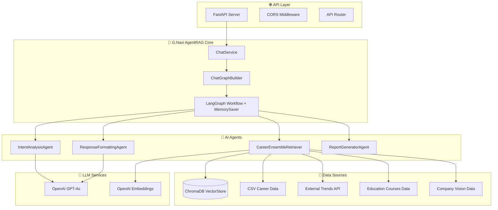
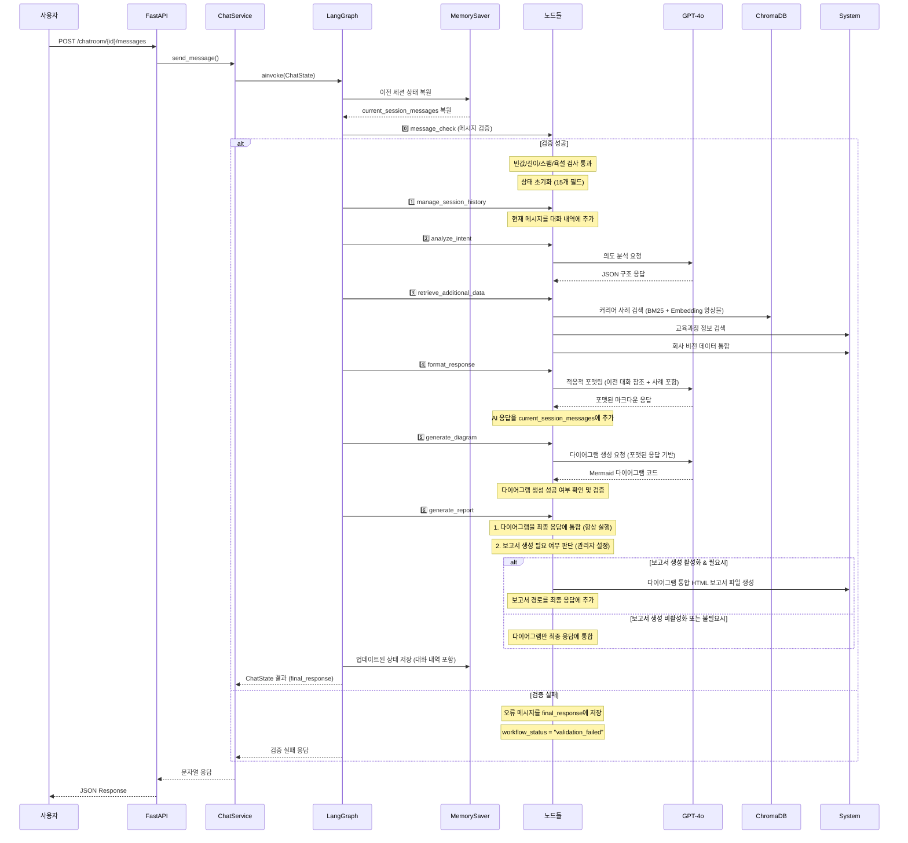

# G.Navi AI Agent 설계 구조

## 📋 목차
- [개요](#개요)
- [시스템 아키텍처](#시스템-아키텍처)
- [AgentRAG 워크플로우](#agentrag-워크플로우)
- [핵심 컴포넌트](#핵심-컴포넌트)
- [데이터 플로우](#데이터-플로우)
- [기술 스택](#기술-스택)
- [API 설계](#api-설계)
- [설치 및 실행](#설치-및-실행)

## 개요

G.Navi는 **AgentRAG(Agent-based Retrieval Augmented Generation)** 아키텍처를 기반으로 한 AI 커리어 컨설팅 시스템입니다. 사내 구성원들의 실제 커리어 사례와 최신 업계 트렌드를 분석하여 개인화된 커리어 조언을 제공합니다.

### 🎯 핵심 특징
- **7단계 AgentRAG 워크플로우**로 구조화된 추론 과정 (메시지 검증 포함)
- **LangGraph + MemorySaver 기반** 상태 관리 및 대화 지속성
- **실제 커리어 사례** 기반 추천 시스템 (BM25 + Embedding 앙상블)
- **회사 비전 및 가치 반영** 커리어 가이드 제공
- **적응적 응답 포맷팅**으로 사용자 맞춤형 출력
- **Mermaid.js 다이어그램 생성** 및 시각적 표현 ⭐
- **스마트 HTML 보고서 생성** 기능 (관리자 제어)
- **대화 연속성 지원**으로 맥락을 유지하는 멀티턴 대화
- **메시지 검증 시스템**으로 부적절한 입력 필터링

## 시스템 아키텍처



## AgentRAG 워크플로우

G.Navi의 핵심인 **7단계 AgentRAG 워크플로우**는 다음과 같습니다:

### 🔄 7단계 처리 과정 (메시지 검증 포함)


### 📊 각 단계별 상세 설명

| 단계 | 담당 Node | 주요 기능 | 출력 |
|------|-----------|-----------|------|
| **0단계** | MessageCheckNode | 메시지 검증 및 상태 초기화 | 조건부 분기 (검증 성공/실패) |
| **1단계** | ChatHistoryNode | MemorySaver 기반 현재 세션 대화 관리 | `current_session_messages` |
| **2단계** | IntentAnalysisNode | 질문 의도 분석 및 상황 파악 | `intent_analysis` |
| **3단계** | DataRetrievalNode | 커리어 사례 + 교육과정 + 회사 비전 검색 | `career_cases`, `education_courses` |
| **4단계** | ResponseFormattingNode | 질문 유형별 적응적 응답 생성 | `formatted_response` |
| **5단계** | DiagramGenerationNode | Mermaid 다이어그램 생성 및 검증 | `mermaid_diagram`, `diagram_generated` |
| **6단계** | ReportGenerationNode | 다이어그램 통합 + HTML 보고서 생성 (관리자 기능) | `final_response`, `report_path` |

## 핵심 컴포넌트

### 🏗️ GraphBuilder (`app/graphs/graph_builder.py`)
```python
class ChatGraphBuilder:
    """G.Navi AgentRAG 시스템의 LangGraph 빌더"""
    
    async def build_persistent_chat_graph(self, conversation_id: str, user_info: Dict[str, Any]):
        # 6단계 노드 구성 + MemorySaver 통합
        workflow.add_node("message_check", self.message_check_node.create_node())
        workflow.add_node("manage_session_history", self.chat_history_node.retrieve_chat_history_node)
        workflow.add_node("analyze_intent", self.intent_analysis_node.analyze_intent_node)
        workflow.add_node("retrieve_additional_data", self.data_retrieval_node.retrieve_additional_data_node)
        workflow.add_node("format_response", self.response_formatting_node.format_response_node)
        workflow.add_node("generate_diagram", self.diagram_generation_node.generate_diagram_node)
        workflow.add_node("generate_report", self.report_generation_node.generate_report_node)
        
        # MemorySaver를 통한 대화 지속성 보장
        compiled_graph = workflow.compile(checkpointer=self.memory_saver)
```

### 🔍 CareerEnsembleRetriever (`app/graphs/agents/retriever.py`)
- **BM25 + Embedding 앙상블 검색**
- **ChromaDB** 벡터 스토어 활용
- **회사 비전 정보** 자동 통합
- **캐시 기반 임베딩** 최적화

### 🧠 IntentAnalysisAgent (`app/graphs/agents/analyzer.py`)
- **범용적 의도 분석**: 모든 질문 유형을 단일 LLM으로 처리
- **구조화된 JSON 응답**: 질문 유형, 복잡도, 키워드 추출
- **적응적 분석**: 질문 복잡도에 따른 유연한 처리

### 📝 ResponseFormattingAgent (`app/graphs/agents/formatter.py`)
- **LLM 기반 적응적 포맷팅**
- **질문 유형별 맞춤 응답**
- **회사 비전 및 가치 반영** 커리어 가이드
- **마크다운 → HTML 변환**
- **동적 콘텐츠 구성**: 사용자 요청에 맞는 최적화된 응답
- **실제 커리어 사례 통합**: 검색된 사례를 활용한 구체적 조언 제공
- **대화 연속성**: 이전 대화 맥락을 고려한 응답 생성

### 📊 ReportGeneratorAgent (`app/graphs/agents/report_generator.py`)
- **스마트 보고서 생성 판단**: 사용자 요청 의도 분석
- **HTML 보고서 자동 생성**: 마크다운을 스타일드 HTML로 변환
- **조건부 실행**: 보고서 필요시에만 생성
- **파일 관리**: output 디렉토리에 timestamp 기반 파일명으로 저장

## 데이터 플로우

### 📊 ChatState 구조
```python
class ChatState(TypedDict, total=False):  # 선택적 필드 허용
    # === 입력 데이터 (필수) ===
    user_question: str                   # 사용자 질문
    user_data: Dict[str, Any]           # 사용자 프로필 데이터
    session_id: str                     # 세션 식별자
    
    # === 메시지 검증 및 상태 관리 ===
    workflow_status: str                # 워크플로우 상태 (normal, validation_failed)
    
    # === 대화 내역 관리 (MemorySaver가 자동 관리) ===
    current_session_messages: List[Dict[str, str]]  # role, content, timestamp
    
    # === G.Navi 6단계 처리 결과 ===
    intent_analysis: Dict[str, Any]       # 2단계: 의도 분석
    career_cases: List[Any]              # 3단계: 커리어 사례 (회사 비전 포함)
    education_courses: Dict[str, Any]    # 3단계: 교육과정 추천
    formatted_response: Dict[str, Any]    # 4단계: 포맷된 응답
    mermaid_diagram: str                 # 5단계: 생성된 Mermaid 다이어그램 코드
    diagram_generated: bool              # 5단계: 다이어그램 생성 성공 여부
    final_response: Dict[str, Any]        # 6단계: 최종 응답 (다이어그램 통합)
    
    # === 메타데이터 및 로깅 ===
    processing_log: List[str]            # 처리 로그 추적
    error_messages: List[str]            # 오류 메시지 수집
    total_processing_time: float         # 총 처리 시간
```

### 🔄 데이터 변환 과정


## 📁 프로젝트 구조

### 🗂️ 핵심 디렉토리 구조
```
app/
├── graphs/
│   ├── __init__.py
│   ├── graph_builder.py          # LangGraph 워크플로우 빌더 + MemorySaver
│   ├── state.py                  # ChatState 정의 (대화 지속성 지원)
│   ├── agents/                   # AI 에이전트들
│   │   ├── retriever.py         # 커리어 데이터 검색 (앙상블 리트리버)
│   │   ├── analyzer.py          # 의도 분석
│   │   ├── formatter.py         # 응답 포맷팅 (대화 맥락 포함)
│   │   ├── mermaid_agent.py     # Mermaid 다이어그램 생성 ⭐
│   │   └── report_generator.py  # 보고서 생성
│   └── nodes/                    # LangGraph 노드들 (모듈화)
│       ├── message_check.py     # 메시지 검증 노드 (0단계)
│       ├── chat_history.py      # 현재 세션 대화 관리 노드 (MemorySaver 연동)
│       ├── intent_analysis.py   # 의도 분석 노드
│       ├── data_retrieval.py    # 추가 데이터 검색 노드
│       ├── response_formatting.py # 응답 포맷팅 노드 (대화 연속성 지원)
│       ├── diagram_generation.py # 다이어그램 생성 노드 ⭐
│       └── report_generation.py # 보고서 생성 노드
├── services/
│   └── chat_service.py          # 채팅 서비스 로직
├── api/
│   └── v1/
│       └── endpoints/
│           └── chat.py          # 채팅 API 엔드포인트
├── data/                        # 데이터 파일들
│   ├── csv/                     # 커리어 히스토리 CSV
│   └── json/                    # 채팅 히스토리 JSON
└── storage/                     # 벡터 스토어 및 캐시
    ├── vector_stores/           # ChromaDB 데이터
    ├── docs/                    # 원본 문서 저장
    └── cache/                   # 임베딩 캐시
```

### 🔧 모듈화된 노드 시스템
G.Navi는 유지보수성과 확장성을 위해 각 처리 단계를 독립적인 노드 클래스로 분리했습니다:

- **`MessageCheckNode`**: 메시지 검증 (빈값, 길이, 스팸, 욕설) 및 상태 초기화
- **`ChatHistoryNode`**: MemorySaver 기반 현재 세션 대화 내역 관리
- **`IntentAnalysisNode`**: LLM 기반 의도 분석 및 상황 파악
- **`DataRetrievalNode`**: 커리어 사례, 교육과정, 회사 비전 검색 (외부 트렌드 제거됨)
- **`ResponseFormattingNode`**: 적응적 응답 포맷팅 (이전 대화 참조)
- **`DiagramGenerationNode`**: Mermaid.js 기반 시각적 다이어그램 생성 ⭐
- **`ReportGenerationNode`**: 다이어그램 통합 + HTML 보고서 생성 (관리자 기능) ⭐

### 📊 HTML 보고서 생성 시스템 (관리자 기능)
6단계 `ReportGenerationNode`는 두 가지 기능을 수행합니다:

**1. 다이어그램 통합 (항상 실행 - 사용자 기능)**
- 생성된 Mermaid 다이어그램을 최종 마크다운 응답에 자동 통합
- 관리자 설정과 무관하게 항상 동작

**2. HTML 보고서 생성 (관리자 기능 - 설정 제어 가능)**
- **관리자 on/off 제어**: 시스템 관리자가 보고서 생성 기능을 활성화/비활성화 가능
- **자동 생성 조건**: 관리자가 활성화한 경우에만 다음 조건 확인
  - 보고서 관련 키워드 감지: "보고서", "리포트", "문서", "저장", "다운로드", "html" 등
  - 상세한 질문 (100자 이상)으로 깊이 있는 분석 요청 시

**생성 결과:**
- Mermaid 다이어그램이 통합된 스타일드 HTML 파일 (`output/사용자명_타임스탬프.html`)
- 다이어그램 렌더링을 위한 Mermaid.js CDN 자동 포함
- 최종 응답에 보고서 파일 경로 자동 추가
- 실패 시 에러 로깅 및 graceful 처리

**관리자 제어:**
- 환경 설정 또는 설정 파일을 통해 보고서 생성 기능 전체 비활성화 가능
- 사용자에게는 다이어그램이 포함된 일반 응답만 제공
- 필요시 관리자가 수동으로 특정 대화에 대해서만 보고서 생성 가능

### 🧠 MemorySaver 기반 대화 지속성
- **자동 상태 복원**: thread_id 기반으로 이전 대화 자동 복원
- **세션 관리**: `current_session_messages`를 통한 대화 내역 지속성
- **컨텍스트 인식**: LLM이 이전 대화를 참조하여 연속성 있는 응답 생성

각 노드는 독립적으로 테스트 가능하며, 새로운 처리 단계를 쉽게 추가할 수 있는 구조입니다.

## 기술 스택

### 🔧 Backend Framework
- **FastAPI**: 고성능 Python 웹 프레임워크
- **Pydantic**: 데이터 검증 및 설정 관리
- **Uvicorn**: ASGI 서버

### 🤖 AI/ML Stack
- **LangGraph**: 워크플로우 오케스트레이션 + MemorySaver
- **LangChain**: LLM 추상화 및 체이닝
- **OpenAI GPT-4o**: 핵심 추론 엔진
- **ChromaDB**: 벡터 데이터베이스
- **OpenAI Embeddings**: 텍스트 임베딩

### 📚 Data Processing
- **Pandas**: 구조화된 데이터 처리
- **BM25**: 키워드 기반 검색
- **Ensemble Retriever**: 하이브리드 검색

### 🚀 Deployment
- **Docker**: 컨테이너화
- **Kubernetes**: 오케스트레이션
- **Harbor Registry**: 이미지 저장소

## API 설계

### 🛣️ 주요 엔드포인트

#### 채팅방 생성
```http
POST /ai/chatroom
Content-Type: application/json

{
  "memberId": "user123",
  "conversationId": "conv_456",
  "userInfo": {
    "name": "이재원",
    "experience": "5년",
    "interests": ["백엔드", "아키텍처"]
  }
}
```

#### 메시지 전송
```http
POST /ai/chatroom/{conversationId}/messages
Content-Type: application/json

{
  "memberId": "user123",
  "messageText": "백엔드에서 풀스택으로 전환하려면 어떻게 해야 할까요?"
}
```

#### 세션 상태 조회
```http
GET /ai/chatroom/{conversationId}/status
```

#### 세션 종료
```http
DELETE /ai/chatroom/{conversationId}
```

### 📋 응답 형식
```json
{
  "conversationId": "conv_456",
  "memberId": "user123",
  "messageText": "사용자 질문",
  "botMessage": "G.Navi AI 응답 (마크다운 형식)",
  "timestamp": "2025-06-12T12:34:56.789Z"
}
```

## 설치 및 실행

### 🔧 환경 설정
```bash
# 가상환경 생성
python -m venv venv
source venv/bin/activate  # Windows: venv\Scripts\activate

# 의존성 설치
pip install -r requirements.txt

# 환경변수 설정
cp .env.example .env
# OPENAI_API_KEY 설정
```

### 🚀 로컬 실행
```bash
# 개발 서버 실행
uvicorn app.main:app --host 0.0.0.0 --port 8001 --reload

# API 문서 확인
# http://localhost:8001/ai/docs
```

### 🐳 Docker 실행
```bash
# 이미지 빌드
docker build -t gnavi-ai .

# 컨테이너 실행
docker run -p 8001:8001 gnavi-ai
```

### ☸️ Kubernetes 배포
```bash
# 네임스페이스 생성
kubectl create namespace sk-team-04

# 배포
kubectl apply -f k8s/deployment.yaml
kubectl apply -f k8s/service.yaml
```

## 모니터링 및 로깅

### 📊 성능 지표
- **응답 시간**: 각 단계별 처리 시간 추적
- **토큰 사용량**: OpenAI API 비용 모니터링
- **검색 정확도**: 커리어 사례 매칭 품질
- **사용자 만족도**: 응답 품질 평가
- **대화 연속성**: 멀티턴 대화의 맥락 유지 품질
- **보고서 생성률**: 조건부 보고서 생성 비율 및 품질

### 📝 로깅 구조
```python
# 처리 로그 예시
processing_log = [
    "[0단계] 메시지 검증 성공: 42자",
    "[1단계] 현재 세션 대화 내역 관리 완료: 복원 2개, 추가 1개",
    "[2단계] 의도 분석 및 상황 이해 완료: 일반 상담",
    "[3단계] 추가 데이터 검색 완료: 커리어 사례 3개, 교육과정 3개",
    "[4단계] 적응적 응답 포맷팅 완료: adaptive 유형, 874자",
    "[5단계] 다이어그램 생성 및 통합 완료: 345자",
    "[6단계] HTML 보고서 생성 완료: /output/사용자명_20250623_154045.html",
    "0단계 처리 시간: 36μs",
    "1단계 처리 시간: 19μs",
    "2단계 처리 시간: 1.084초", 
    "3단계 처리 시간: 1.476초",
    "4단계 처리 시간: 7.691초",
    "5단계 처리 시간: 2.823초",
    "6단계 처리 시간: 0.050초"
]
```

---

> **G.Navi AI Agent**는 실제 사내 커리어 데이터와 AI의 추론 능력을 결합하여, 개인화되고 실행 가능한 커리어 조언을 제공하는 차세대 AI 컨설팅 시스템입니다. MemorySaver 기반의 대화 지속성과 스마트 보고서 생성 기능으로 사용자와의 자연스러운 멀티턴 대화 및 체계적인 커리어 분석을 지원합니다.
