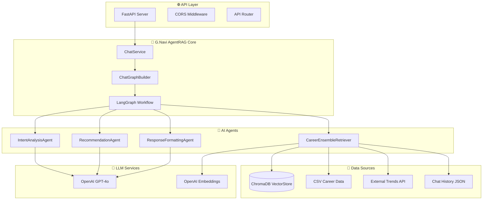
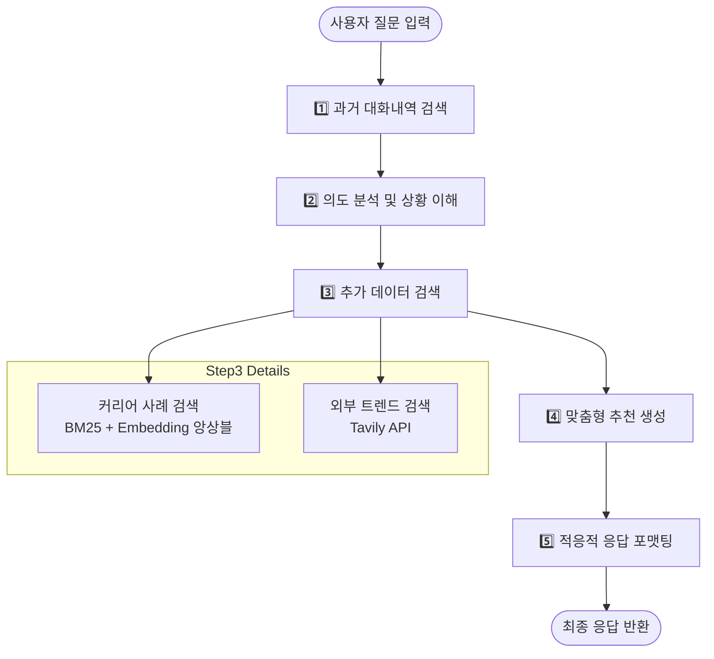
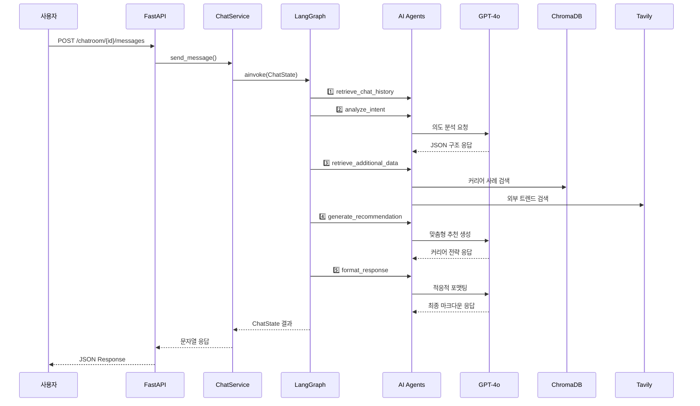

# G.Navi AI Agent 설계 구조

## 📋 목차
- [개요](#개요)
- [시스템 아키텍처](#시스템-아키텍처)
- [AgentRAG 워크플로우](#agentrag-워크플로우)
- [핵심 컴포넌트](#핵심-컴포넌트)
- [데이터 플로우](#데이터-플로우)
- [기술 스택](#기술-스택)
- [API 설계](#api-설계)
- [설치 및 실행](#설치-및-실행)

## 개요

G.Navi는 **AgentRAG(Agent-based Retrieval Augmented Generation)** 아키텍처를 기반으로 한 AI 커리어 컨설팅 시스템입니다. 사내 구성원들의 실제 커리어 사례와 최신 업계 트렌드를 분석하여 개인화된 커리어 조언을 제공합니다.

### 🎯 핵심 특징
- **5단계 AgentRAG 워크플로우**로 구조화된 추론 과정
- **LangGraph 기반** 상태 관리 및 워크플로우 엔진
- **실제 커리어 사례** 기반 추천 시스템
- **적응적 응답 포맷팅**으로 사용자 맞춤형 출력

## 시스템 아키텍처



## AgentRAG 워크플로우

G.Navi의 핵심인 **5단계 AgentRAG 워크플로우**는 다음과 같습니다:

### 🔄 5단계 처리 과정



### 📊 각 단계별 상세 설명

| 단계 | 담당 Agent | 주요 기능 | 출력 |
|------|------------|-----------|------|
| **1단계** | CareerEnsembleRetriever | 사용자별 과거 대화내역 검색 | `chat_history_results` |
| **2단계** | IntentAnalysisAgent | 질문 의도 분석 및 상황 파악 | `intent_analysis` |
| **3단계** | CareerEnsembleRetriever | 유사 커리어 사례 + 트렌드 검색 | `career_cases`, `external_trends` |
| **4단계** | RecommendationAgent | 개인화된 커리어 전략 수립 | `recommendation` |
| **5단계** | ResponseFormattingAgent | 질문 유형별 적응적 응답 생성 | `final_response` |

## 핵심 컴포넌트

### 🏗️ GraphBuilder (`app/graphs/graph_builder.py`)
```python
class ChatGraphBuilder:
    """G.Navi AgentRAG 시스템의 LangGraph 빌더"""
    
    async def build_persistent_chat_graph(self, conversation_id: str, user_info: Dict[str, Any]):
        # 5단계 노드 구성
        workflow.add_node("retrieve_chat_history", self._retrieve_chat_history_node)
        workflow.add_node("analyze_intent", self._analyze_intent_node)
        workflow.add_node("retrieve_additional_data", self._retrieve_additional_data_node)
        workflow.add_node("generate_recommendation", self._generate_recommendation_node)
        workflow.add_node("format_response", self._format_response_node)
```

### 🔍 CareerEnsembleRetriever (`app/graphs/nodes/retriever.py`)
- **BM25 + Embedding 앙상블 검색**
- **ChromaDB** 벡터 스토어 활용
- **Tavily API** 외부 트렌드 검색
- **캐시 기반 임베딩** 최적화

### 🧠 IntentAnalysisAgent (`app/graphs/nodes/analyzer.py`)
- **범용적 의도 분석**: 모든 질문 유형을 단일 LLM으로 처리
- **구조화된 JSON 응답**: 질문 유형, 복잡도, 키워드 추출
- **적응적 분석**: 질문 복잡도에 따른 유연한 처리

### 💡 RecommendationAgent (`app/graphs/nodes/advisor.py`)
- **실제 커리어 사례 기반** 추천
- **최신 트렌드 연계** 미래 지향적 조언
- **단계별 실행 계획** 수립
- **참고 롤모델** 제시

### 📝 ResponseFormattingAgent (`app/graphs/nodes/formatter.py`)
- **LLM 기반 적응적 포맷팅**
- **질문 유형별 맞춤 응답**
- **마크다운 → HTML 변환**
- **동적 콘텐츠 구성**: 사용자 요청에 맞는 최적화된 응답

## 데이터 플로우

### 📊 ChatState 구조
```python
class ChatState(TypedDict):
    # 입력 데이터
    user_question: str
    user_data: Dict[str, Any]
    session_id: str
    
    # 5단계 처리 결과
    chat_history_results: List[Any]      # 1단계
    intent_analysis: Dict[str, Any]       # 2단계
    career_cases: List[Any]              # 3단계
    external_trends: List[Dict]          # 3단계
    recommendation: Dict[str, Any]        # 4단계 (COT 생각해서 넣었으나, 성능 문제로 현재는 제외시킴)
    final_response: Dict[str, Any]        # 5단계
    
    # 메타데이터
    processing_log: List[str]
    error_messages: List[str]
    total_processing_time: float
```

### 🔄 데이터 변환 과정


## 기술 스택

### 🔧 Backend Framework
- **FastAPI**: 고성능 Python 웹 프레임워크
- **Pydantic**: 데이터 검증 및 설정 관리
- **Uvicorn**: ASGI 서버

### 🤖 AI/ML Stack
- **LangGraph**: 워크플로우 오케스트레이션
- **LangChain**: LLM 추상화 및 체이닝
- **OpenAI GPT-4o**: 핵심 추론 엔진
- **ChromaDB**: 벡터 데이터베이스
- **OpenAI Embeddings**: 텍스트 임베딩

### 📚 Data Processing
- **Pandas**: 구조화된 데이터 처리
- **BM25**: 키워드 기반 검색
- **Ensemble Retriever**: 하이브리드 검색
- **Tavily API**: 외부 트렌드 데이터

### 🚀 Deployment
- **Docker**: 컨테이너화
- **Kubernetes**: 오케스트레이션
- **Harbor Registry**: 이미지 저장소

## API 설계

### 🛣️ 주요 엔드포인트

#### 채팅방 생성
```http
POST /ai/chatroom
Content-Type: application/json

{
  "memberId": "user123",
  "conversationId": "conv_456",
  "userInfo": {
    "name": "이재원",
    "experience": "5년",
    "interests": ["백엔드", "아키텍처"]
  }
}
```

#### 메시지 전송
```http
POST /ai/chatroom/{conversationId}/messages
Content-Type: application/json

{
  "memberId": "user123",
  "messageText": "백엔드에서 풀스택으로 전환하려면 어떻게 해야 할까요?"
}
```

#### 세션 상태 조회
```http
GET /ai/chatroom/{conversationId}/status
```

#### 세션 종료
```http
DELETE /ai/chatroom/{conversationId}
```

### 📋 응답 형식
```json
{
  "conversationId": "conv_456",
  "memberId": "user123",
  "messageText": "사용자 질문",
  "botMessage": "G.Navi AI 응답 (마크다운 형식)",
  "timestamp": "2025-06-12T12:34:56.789Z"
}
```

## 설치 및 실행

### 🔧 환경 설정
```bash
# 가상환경 생성
python -m venv venv
source venv/bin/activate  # Windows: venv\Scripts\activate

# 의존성 설치
pip install -r requirements.txt

# 환경변수 설정
cp .env.example .env
# OPENAI_API_KEY, TAVILY_API_KEY 설정
```

### 🚀 로컬 실행
```bash
# 개발 서버 실행
uvicorn app.main:app --host 0.0.0.0 --port 8001 --reload

# API 문서 확인
# http://localhost:8001/ai/docs
```

### 🐳 Docker 실행
```bash
# 이미지 빌드
docker build -t gnavi-ai .

# 컨테이너 실행
docker run -p 8001:8001 gnavi-ai
```

### ☸️ Kubernetes 배포
```bash
# 네임스페이스 생성
kubectl create namespace sk-team-04

# 배포
kubectl apply -f k8s/deployment.yaml
kubectl apply -f k8s/service.yaml
```

## 모니터링 및 로깅

### 📊 성능 지표
- **응답 시간**: 각 단계별 처리 시간 추적
- **토큰 사용량**: OpenAI API 비용 모니터링
- **검색 정확도**: 커리어 사례 매칭 품질
- **사용자 만족도**: 응답 품질 평가

### 📝 로깅 구조
```python
# 처리 로그 예시
processing_log = [
    "과거 대화내역 검색 완료: 3개 (사용자: user123)",
    "의도 분석 및 상황 이해 완료",
    "추가 데이터 검색 완료: 커리어 사례 5개, 트렌드 정보 3개",
    "맞춤형 추천 생성 완료",
    "적응적 응답 포맷팅 완료 (유형: specific_consultation)",
    "1단계 처리 시간: 0.85초",
    "2단계 처리 시간: 2.34초",
    "3단계 처리 시간: 1.92초",
    "4단계 처리 시간: 4.17초",
    "5단계 처리 시간: 3.28초"
]
```

---

> **G.Navi AI Agent**는 실제 사내 커리어 데이터와 AI의 추론 능력을 결합하여, 개인화되고 실행 가능한 커리어 조언을 제공하는 차세대 AI 컨설팅 시스템입니다.