# G.Navi AI Agent 설계 구조

## 📋 목차
- [개요](#개요)
- [시스템 아키텍처](#시스템-아키텍처)
- [AgentRAG 워크플로우](#agentrag-워크플로우)
- [핵심 컴포넌트](#핵심-컴포넌트)
- [데이터 플로우](#데이터-플로우)
- [기술 스택](#기술-스택)
- [API 설계](#api-설계)
- [설치 및 실행](#설치-및-실행)

## 개요

G.Navi는 **AgentRAG(Agent-based Retrieval Augmented Generation)** 아키텍처를 기반으로 한 AI 커리어 컨설팅 시스템입니다. 사내 구성원들의 실제 커리어 사례와 최신 업계 트렌드를 분석하여 개인화된 커리어 조언을 제공합니다.

### 🎯 핵심 특징
- **5단계 AgentRAG 워크플로우**로 구조화된 추론 과정
- **LangGraph + MemorySaver 기반** 상태 관리 및 대화 지속성
- **실제 커리어 사례** 기반 추천 시스템
- **회사 비전 및 가치 반영** 커리어 가이드 제공
- **적응적 응답 포맷팅**으로 사용자 맞춤형 출력
- **스마트 HTML 보고서 생성** 기능
- **대화 연속성 지원**으로 맥락을 유지하는 멀티턴 대화

## 시스템 아키텍처


## AgentRAG 워크플로우

G.Navi의 핵심인 **6단계 AgentRAG 워크플로우**는 다음과 같습니다:

### 🔄 6단계 처리 과정

```mermaid
flowchart TD
    Start([사용자 질문 입력]) --> Check{메시지 확인}
    Check -->|메시지 있음| Step1[1️⃣ 현재 세션 대화내역 관리]
    Check -->|메시지 없음| Wait[⏳ 대기 상태]
    
    Step1 --> Step2[2️⃣ 의도 분석 및 상황 이해]
    Step2 --> Step3[3️⃣ 추가 데이터 검색]
    Step3 --> Step4[4️⃣ 적응적 응답 포맷팅]
    Step4 --> Step5[5️⃣ 다이어그램 생성]
    Step5 --> Step6[6️⃣ 스마트 보고서 생성]
    Step6 --> End([최종 응답 반환])
    Wait --> End
    
    subgraph "Step1 Details"
        Step1A[MemorySaver에서<br/>이전 대화 복원]
        Step1B[현재 메시지<br/>대화 내역에 추가]
    end
    
    subgraph "Step3 Details"
        Step3A[커리어 사례 검색<br/>BM25 + Embedding 앙상블]
        Step3C[교육과정 정보<br/>검색 및 추천]
    end
    
    subgraph "Step5 Details"
        Step5A[응답 내용 분석]
        Step5B[다이어그램 유형 선택<br/>Flowchart/Timeline/Mindmap 등]
        Step5C[Mermaid 코드 생성]
    end
    
    subgraph "Step6 Details"
        Step6A{보고서 생성<br/>필요 여부 판단}
        Step6B[다이어그램 통합<br/>HTML 보고서 생성]
        Step6C[최종 응답에<br/>보고서 경로 추가]
    end
    
    Step1 --> Step1A
    Step1 --> Step1B
    Step3 --> Step3A
    Step3 --> Step3C
    Step5 --> Step5A
    Step5A --> Step5B
    Step5B --> Step5C
    Step6 --> Step6A
    Step6A -->|필요시| Step6B
    Step6B --> Step6C
    Step6A -->|불필요시| End
```



### 📊 각 단계별 상세 설명

| 단계 | 담당 Node | 주요 기능 | 출력 |
|------|-----------|-----------|------|
| **0단계** | MessageCheckNode | 메시지 유무 확인 및 상태 초기화 | 조건부 분기 |
| **1단계** | ChatHistoryNode | MemorySaver 기반 현재 세션 대화 관리 | `current_session_messages` |
| **2단계** | IntentAnalysisNode | 질문 의도 분석 및 상황 파악 | `intent_analysis` |
| **3단계** | DataRetrievalNode | 커리어 사례 + 교육과정 + 회사 비전 검색 | `career_cases`, `education_courses` |
| **4단계** | ResponseFormattingNode | 질문 유형별 적응적 응답 생성 | `formatted_response` |
| **5단계** | DiagramGenerationNode | Mermaid 다이어그램 생성 | `mermaid_diagram`, `diagram_generated` |
| **6단계** | ReportGenerationNode | 다이어그램 통합 HTML 보고서 생성 (조건부) | `final_response`, `report_path` |

## 핵심 컴포넌트

### 🏗️ GraphBuilder (`app/graphs/graph_builder.py`)
```python
class ChatGraphBuilder:
    """G.Navi AgentRAG 시스템의 LangGraph 빌더"""
    
    async def build_persistent_chat_graph(self, conversation_id: str, user_info: Dict[str, Any]):
        # 6단계 노드 구성 + MemorySaver 통합
        workflow.add_node("message_check", self.message_check_node.create_node())
        workflow.add_node("manage_session_history", self.chat_history_node.retrieve_chat_history_node)
        workflow.add_node("analyze_intent", self.intent_analysis_node.analyze_intent_node)
        workflow.add_node("retrieve_additional_data", self.data_retrieval_node.retrieve_additional_data_node)
        workflow.add_node("format_response", self.response_formatting_node.format_response_node)
        workflow.add_node("generate_diagram", self.diagram_generation_node.generate_diagram_node)
        workflow.add_node("generate_report", self.report_generation_node.generate_report_node)
        workflow.add_node("wait_state", self.wait_node.create_node())
        
        # MemorySaver를 통한 대화 지속성 보장
        compiled_graph = workflow.compile(checkpointer=self.memory_saver)
```

### 🔍 CareerEnsembleRetriever (`app/graphs/agents/retriever.py`)
- **BM25 + Embedding 앙상블 검색**
- **ChromaDB** 벡터 스토어 활용
- **회사 비전 정보** 자동 통합
- **캐시 기반 임베딩** 최적화

### 🧠 IntentAnalysisAgent (`app/graphs/agents/analyzer.py`)
- **범용적 의도 분석**: 모든 질문 유형을 단일 LLM으로 처리
- **구조화된 JSON 응답**: 질문 유형, 복잡도, 키워드 추출
- **적응적 분석**: 질문 복잡도에 따른 유연한 처리

### 📝 ResponseFormattingAgent (`app/graphs/agents/formatter.py`)
- **LLM 기반 적응적 포맷팅**
- **질문 유형별 맞춤 응답**
- **회사 비전 및 가치 반영** 커리어 가이드
- **마크다운 → HTML 변환**
- **동적 콘텐츠 구성**: 사용자 요청에 맞는 최적화된 응답
- **실제 커리어 사례 통합**: 검색된 사례를 활용한 구체적 조언 제공
- **대화 연속성**: 이전 대화 맥락을 고려한 응답 생성

### 📊 ReportGeneratorAgent (`app/graphs/agents/report_generator.py`)
- **스마트 보고서 생성 판단**: 사용자 요청 의도 분석
- **HTML 보고서 자동 생성**: 마크다운을 스타일드 HTML로 변환
- **조건부 실행**: 보고서 필요시에만 생성
- **파일 관리**: output 디렉토리에 timestamp 기반 파일명으로 저장

## 데이터 플로우

### 📊 ChatState 구조
```python
class ChatState(TypedDict, total=False):  # 선택적 필드 허용
    # 입력 데이터 (필수)
    user_question: str
    user_data: Dict[str, Any]
    session_id: str
    
    # 대화 내역 관리 (MemorySaver가 자동 관리)
    current_session_messages: List[Dict[str, str]]  # role, content, timestamp
    
    # 6단계 처리 결과
    intent_analysis: Dict[str, Any]       # 2단계: 의도 분석
    career_cases: List[Any]              # 3단계: 커리어 사례 (회사 비전 포함)
    education_courses: Dict[str, Any]    # 3단계: 교육과정 추천
    formatted_response: Dict[str, Any]    # 4단계: 포맷된 응답
    mermaid_diagram: str                 # 5단계: 생성된 Mermaid 다이어그램 코드
    diagram_generated: bool              # 5단계: 다이어그램 생성 성공 여부
    final_response: Dict[str, Any]        # 6단계: 최종 응답 (다이어그램 통합)
    report_generated: bool               # 6단계: 보고서 생성 여부
    report_path: str                     # 6단계: 생성된 보고서 파일 경로
    
    # 메타데이터
    processing_log: List[str]
    error_messages: List[str]
    total_processing_time: float
```

### 🔄 데이터 변환 과정


## 📁 프로젝트 구조

### 🗂️ 핵심 디렉토리 구조
```
app/
├── graphs/
│   ├── __init__.py
│   ├── graph_builder.py          # LangGraph 워크플로우 빌더 + MemorySaver
│   ├── state.py                  # ChatState 정의 (대화 지속성 지원)
│   ├── agents/                   # AI 에이전트들
│   │   ├── retriever.py         # 커리어 데이터 검색
│   │   ├── analyzer.py          # 의도 분석
│   │   ├── formatter.py         # 응답 포맷팅 (대화 맥락 포함)
│   │   └── report_generator.py  # 보고서 생성
│   └── nodes/                    # LangGraph 노드들 (모듈화)
│       ├── message_check.py     # 메시지 확인 노드
│       ├── chat_history.py      # 현재 세션 대화 관리 노드 (MemorySaver 연동)
│       ├── intent_analysis.py   # 의도 분석 노드
│       ├── data_retrieval.py    # 추가 데이터 검색 노드
│       ├── response_formatting.py # 응답 포맷팅 노드 (대화 연속성 지원)
│       ├── report_generation.py # 보고서 생성 노드
│       └── wait_node.py         # 대기 상태 노드
├── services/
│   └── chat_service.py          # 채팅 서비스 로직
├── api/
│   └── v1/
│       └── endpoints/
│           └── chat.py          # 채팅 API 엔드포인트
├── data/                        # 데이터 파일들
│   ├── csv/                     # 커리어 히스토리 CSV
│   └── json/                    # 채팅 히스토리 JSON
└── storage/                     # 벡터 스토어 및 캐시
    ├── vector_stores/           # ChromaDB 데이터
    └── cache/                   # 임베딩 캐시
```

### 🔧 모듈화된 노드 시스템
G.Navi는 유지보수성과 확장성을 위해 각 처리 단계를 독립적인 노드 클래스로 분리했습니다:

- **`MessageCheckNode`**: 메시지 유무 확인 및 상태 초기화
- **`ChatHistoryNode`**: MemorySaver 기반 현재 세션 대화 내역 관리
- **`IntentAnalysisNode`**: LLM 기반 의도 분석 및 상황 파악
- **`DataRetrievalNode`**: 커리어 사례, 외부 트렌드, 교육과정 검색
- **`ResponseFormattingNode`**: 적응적 응답 포맷팅 및 HTML 변환 (이전 대화 참조)
- **`DiagramGenerationNode`**: Mermaid.js 기반 시각적 다이어그램 생성 ⭐
- **`ReportGenerationNode`**: 다이어그램 통합 HTML 보고서 생성 (조건부 실행)
- **`WaitNode`**: 메시지 대기 상태 처리

### 📊 스마트 보고서 생성 시스템
6단계 `ReportGenerationNode`는 다음과 같은 조건에서 HTML 보고서를 자동 생성합니다:

**자동 생성 조건:**
- 보고서 관련 키워드 감지: "보고서", "리포트", "문서", "저장", "다운로드", "html" 등
- 상세한 질문 (100자 이상)으로 깊이 있는 분석 요청 시

**생성 결과:**
- Mermaid 다이어그램이 통합된 스타일드 HTML 파일 (`output/사용자명_타임스탬프.html`)
- 다이어그램 렌더링을 위한 Mermaid.js CDN 자동 포함
- 최종 응답에 보고서 파일 경로 자동 추가
- 실패 시 에러 로깅 및 graceful 처리

### 🧠 MemorySaver 기반 대화 지속성
- **자동 상태 복원**: thread_id 기반으로 이전 대화 자동 복원
- **세션 관리**: `current_session_messages`를 통한 대화 내역 지속성
- **컨텍스트 인식**: LLM이 이전 대화를 참조하여 연속성 있는 응답 생성

각 노드는 독립적으로 테스트 가능하며, 새로운 처리 단계를 쉽게 추가할 수 있는 구조입니다.

## 기술 스택

### 🔧 Backend Framework
- **FastAPI**: 고성능 Python 웹 프레임워크
- **Pydantic**: 데이터 검증 및 설정 관리
- **Uvicorn**: ASGI 서버

### 🤖 AI/ML Stack
- **LangGraph**: 워크플로우 오케스트레이션 + MemorySaver
- **LangChain**: LLM 추상화 및 체이닝
- **OpenAI GPT-4o**: 핵심 추론 엔진
- **ChromaDB**: 벡터 데이터베이스
- **OpenAI Embeddings**: 텍스트 임베딩

### 📚 Data Processing
- **Pandas**: 구조화된 데이터 처리
- **BM25**: 키워드 기반 검색
- **Ensemble Retriever**: 하이브리드 검색

### 🚀 Deployment
- **Docker**: 컨테이너화
- **Kubernetes**: 오케스트레이션
- **Harbor Registry**: 이미지 저장소

## API 설계

### 🛣️ 주요 엔드포인트

#### 채팅방 생성
```http
POST /ai/chatroom
Content-Type: application/json

{
  "memberId": "user123",
  "conversationId": "conv_456",
  "userInfo": {
    "name": "이재원",
    "experience": "5년",
    "interests": ["백엔드", "아키텍처"]
  }
}
```

#### 메시지 전송
```http
POST /ai/chatroom/{conversationId}/messages
Content-Type: application/json

{
  "memberId": "user123",
  "messageText": "백엔드에서 풀스택으로 전환하려면 어떻게 해야 할까요?"
}
```

#### 세션 상태 조회
```http
GET /ai/chatroom/{conversationId}/status
```

#### 세션 종료
```http
DELETE /ai/chatroom/{conversationId}
```

### 📋 응답 형식
```json
{
  "conversationId": "conv_456",
  "memberId": "user123",
  "messageText": "사용자 질문",
  "botMessage": "G.Navi AI 응답 (마크다운 형식)",
  "timestamp": "2025-06-12T12:34:56.789Z"
}
```

## 설치 및 실행

### 🔧 환경 설정
```bash
# 가상환경 생성
python -m venv venv
source venv/bin/activate  # Windows: venv\Scripts\activate

# 의존성 설치
pip install -r requirements.txt

# 환경변수 설정
cp .env.example .env
# OPENAI_API_KEY 설정
```

### 🚀 로컬 실행
```bash
# 개발 서버 실행
uvicorn app.main:app --host 0.0.0.0 --port 8001 --reload

# API 문서 확인
# http://localhost:8001/ai/docs
```

### 🐳 Docker 실행
```bash
# 이미지 빌드
docker build -t gnavi-ai .

# 컨테이너 실행
docker run -p 8001:8001 gnavi-ai
```

### ☸️ Kubernetes 배포
```bash
# 네임스페이스 생성
kubectl create namespace sk-team-04

# 배포
kubectl apply -f k8s/deployment.yaml
kubectl apply -f k8s/service.yaml
```

## 모니터링 및 로깅

### 📊 성능 지표
- **응답 시간**: 각 단계별 처리 시간 추적
- **토큰 사용량**: OpenAI API 비용 모니터링
- **검색 정확도**: 커리어 사례 매칭 품질
- **사용자 만족도**: 응답 품질 평가
- **대화 연속성**: 멀티턴 대화의 맥락 유지 품질
- **보고서 생성률**: 조건부 보고서 생성 비율 및 품질

### 📝 로깅 구조
```python
# 처리 로그 예시
processing_log = [
    "현재 세션 대화 내역 관리 완료: 3개",
    "의도 분석 및 상황 이해 완료",
    "추가 데이터 검색 완료: 커리어 사례 5개, 트렌드 정보 3개, 교육과정 8개",
    "적응적 응답 포맷팅 완료 (유형: specific_consultation)",
    "보고서 생성 검토: 키워드 감지됨 → HTML 보고서 생성",
    "1단계 처리 시간: 0.85초",
    "2단계 처리 시간: 2.34초", 
    "3단계 처리 시간: 1.92초",
    "4단계 처리 시간: 3.28초",
    "5단계 처리 시간: 1.15초"
]
```

---

> **G.Navi AI Agent**는 실제 사내 커리어 데이터와 AI의 추론 능력을 결합하여, 개인화되고 실행 가능한 커리어 조언을 제공하는 차세대 AI 컨설팅 시스템입니다. MemorySaver 기반의 대화 지속성과 스마트 보고서 생성 기능으로 사용자와의 자연스러운 멀티턴 대화 및 체계적인 커리어 분석을 지원합니다.

# G.Navi AI API

G.Navi는 LangGraph 기반의 AgentRAG 시스템으로 개인화된 커리어 상담 서비스를 제공합니다.

## 🚀 주요 특징

### 🤖 AgentRAG 시스템
- **LangGraph 기반**: 상태 관리와 워크플로우 최적화
- **다중 에이전트**: 역할별 전문화된 AI 에이전트들
- **RAG 통합**: 실시간 데이터 검색과 생성형 AI 결합
- **메모리 관리**: 대화 히스토리 유지 및 컨텍스트 보존

### 🎯 6단계 워크플로우


1. **히스토리 관리**: 사용자별 대화 컨텍스트 관리
2. **의도 분석**: 질문 유형과 카테고리 분석
3. **데이터 검색**: 관련 커리어 정보 RAG 검색
4. **응답 포맷팅**: 구조화된 마크다운 응답 생성
5. **다이어그램 생성**: Mermaid.js 기반 시각적 다이어그램 생성
6. **보고서 생성**: HTML 보고서 및 최종 응답 통합

## 🔧 핵심 에이전트

### 1. 🎯 IntentAnalysisAgent
**역할**: 사용자 질문의 의도와 카테고리 분석
- 질문 유형 분류 (커리어, 학습, 기술 등)
- 우선순위 기반 카테고리 매핑
- 컨텍스트 기반 의도 추론

### 2. 🔍 CareerEnsembleRetrieverAgent  
**역할**: 다중 소스 커리어 데이터 검색
- Vector Store 기반 유사도 검색
- 키워드 기반 정확도 검색
- 하이브리드 앙상블 결과 통합

### 3. 📝 ResponseFormattingAgent
**역할**: 구조화된 응답 생성 및 포맷팅
- 마크다운 기반 응답 구조화
- 사용자 맞춤형 컨텍스트 반영
- 일관된 G.Navi 브랜딩 적용

### 4. 🎨 MermaidDiagramAgent *(NEW)*
**역할**: AI 기반 시각적 다이어그램 생성
- 응답 내용 분석하여 최적 다이어그램 유형 선택
- Flowchart, Timeline, Mindmap, Sequence 등 지원
- 한국어 텍스트 최적화 및 Mermaid.js 호환성 보장

### 5. 📊 ReportGenerationAgent
**역할**: 통합 보고서 생성 및 최종 출력
- HTML 기반 시각적 보고서 생성
- Mermaid 다이어그램 렌더링 지원
- 대화 히스토리 및 메타데이터 통합

## 🏗️ 시스템 아키텍처

### 디렉토리 구조
```
app/
├── graphs/
│   ├── agents/           # 전문화된 AI 에이전트들
│   │   ├── analyzer.py       # 의도 분석
│   │   ├── retriever.py      # 데이터 검색
│   │   ├── formatter.py      # 응답 포맷팅
│   │   ├── mermaid_agent.py  # 다이어그램 생성 ⭐
│   │   └── report_generator.py # 보고서 생성
│   ├── nodes/            # LangGraph 워크플로우 노드들
│   │   ├── message_check.py
│   │   ├── chat_history.py
│   │   ├── intent_analysis.py
│   │   ├── data_retrieval.py
│   │   ├── response_formatting.py
│   │   ├── diagram_generation.py ⭐
│   │   ├── report_generation.py
│   │   └── wait_node.py
│   ├── state.py          # 상태 관리
│   └── graph_builder.py  # 그래프 빌더
├── core/                 # 핵심 유틸리티
└── api/                  # FastAPI 엔드포인트
```

### 📊 상태 관리 (ChatState)
```python
class ChatState(TypedDict):
    # 기본 정보
    user_question: str
    session_id: str
    user_data: Dict[str, Any]
    
    # 분석 결과
    intent_analysis: Dict[str, Any]
    retrieved_data: List[Dict[str, Any]]
    
    # 응답 생성
    formatted_response: str      # 중간 응답 (다이어그램 생성용)
    mermaid_diagram: str         # 생성된 Mermaid 코드 ⭐
    diagram_generated: bool      # 다이어그램 생성 성공 여부 ⭐
    
    # 최종 출력
    chat_response: str
    html_report: str
```

## 🎨 Mermaid 다이어그램 기능

### 지원하는 다이어그램 유형
1. **Flowchart**: 커리어 경로, 학습 로드맵, 의사결정 과정
2. **Timeline**: 시간 순서 기반 발전 계획
3. **Mindmap**: 기술 스택, 역량 체계 분류
4. **Sequence**: 협업 과정, 업무 절차
5. **Class**: 조직 구조, 역할 관계

### 동적 다이어그램 생성 프로세스


### 특징
- **AI 기반 유형 선택**: 컨텍스트에 맞는 최적 다이어그램 자동 선택
- **한국어 최적화**: 따옴표 처리로 한글 텍스트 안정성 보장
- **안정적 렌더링**: 실패 시에도 워크플로우 중단 없이 진행
- **HTML 통합**: Mermaid.js CDN을 통한 브라우저 렌더링

## 🔄 워크플로우 상세

### 1단계: 히스토리 관리
- 세션별 대화 컨텍스트 로드
- 사용자 정보 및 이전 대화 연결
- 개인화된 상담 기반 마련

### 2단계: 의도 분석  
- GPT-4o-mini 기반 질문 의도 파악
- 카테고리별 우선순위 매핑
- 후속 검색 전략 수립

### 3단계: 데이터 검색
- Vector Store 유사도 검색
- 키워드 기반 정확도 검색  
- 앙상블 기법으로 결과 통합

### 4단계: 응답 포맷팅
- 구조화된 마크다운 응답 생성
- 사용자 맞춤형 조언 제공
- G.Navi 브랜딩 일관성 유지

### 5단계: 다이어그램 생성 ⭐
- 응답 내용 기반 시각적 표현 최적화
- Mermaid.js 다이어그램 동적 생성
- 복잡한 정보의 구조적 시각화

### 6단계: 보고서 생성
- HTML 기반 최종 보고서 생성
- 다이어그램 렌더링 통합
- 대화 히스토리 및 메타데이터 포함

## 🚀 설치 및 실행

### 환경 설정
```bash
# 의존성 설치
pip install -r requirements.txt

# 환경 변수 설정
export OPENAI_API_KEY="your-openai-api-key"
export PINECONE_API_KEY="your-pinecone-api-key"
```

### 실행
```bash
# FastAPI 서버 시작
uvicorn app.main:app --reload --host 0.0.0.0 --port 8000
```

### API 엔드포인트
- `POST /chat`: 채팅 대화 (다이어그램 포함)
- `GET /health`: 서버 상태 확인
- `GET /sessions`: 활성 세션 조회

## 🎯 사용 예시

### 질문 예시
```
"백엔드 개발자에서 PM으로 전환하고 싶은데, 어떤 로드맵을 추천하시나요?"
```

### 응답 구조
```markdown
## 🎯 백엔드 개발자 → PM 전환 로드맵

### 📋 현재 상황 분석
...

### 🚀 추천 전환 전략
...

[Mermaid 다이어그램 자동 생성]

### 💡 G.Navi의 조언
...
```

## 🔧 기술 스택

- **Framework**: FastAPI, LangGraph
- **AI/ML**: OpenAI GPT-4o-mini, LangChain
- **Vector DB**: Pinecone
- **Visualization**: Mermaid.js
- **Language**: Python 3.9+

## 📈 향후 계획

- [ ] 더 다양한 다이어그램 유형 지원
- [ ] 실시간 협업 다이어그램 편집
- [ ] 다이어그램 스타일 커스터마이징
- [ ] 모바일 최적화 렌더링
- [ ] 다이어그램 기반 인터랙티브 상담

---

**G.Navi AI** - 당신의 커리어 여정을 시각적으로 안내합니다 🧭✨
